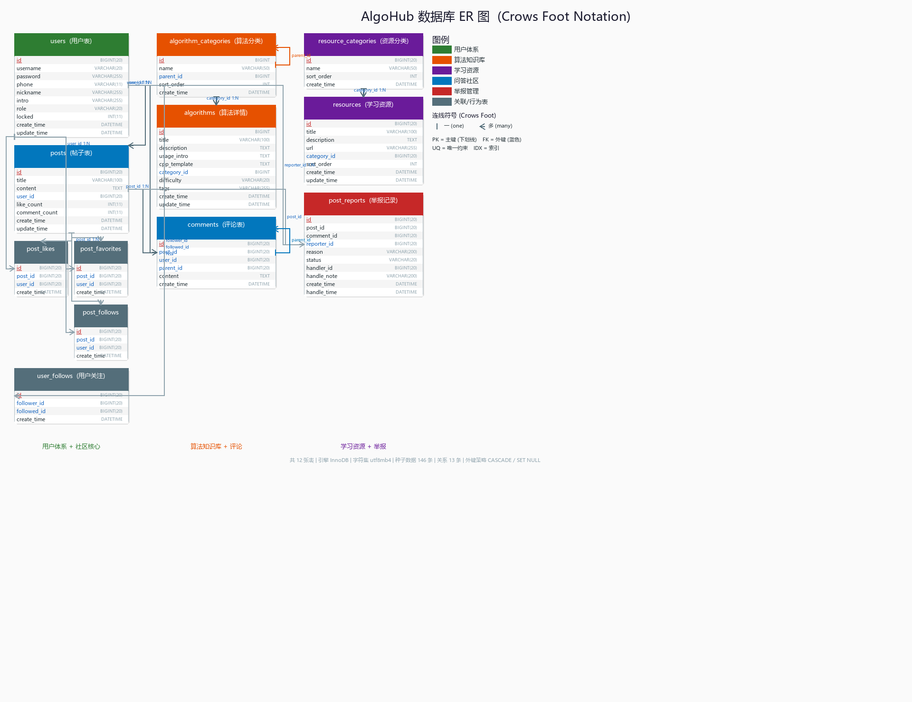
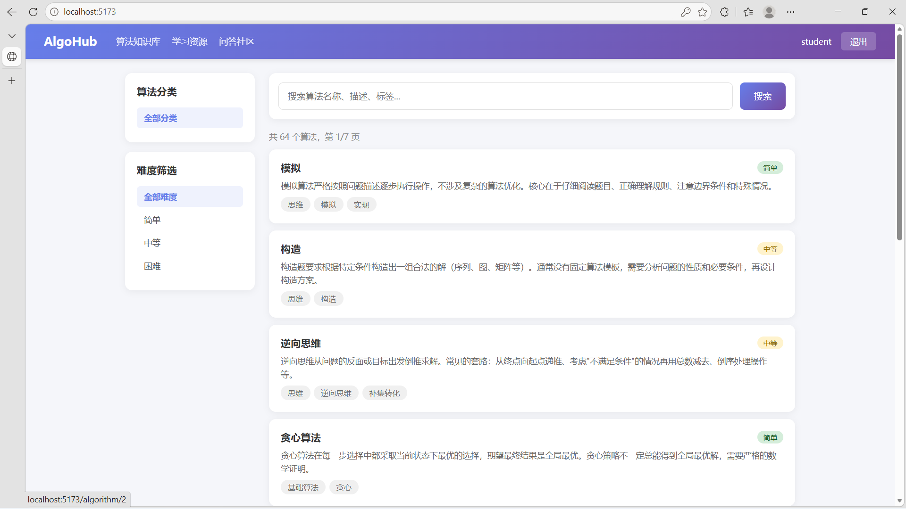
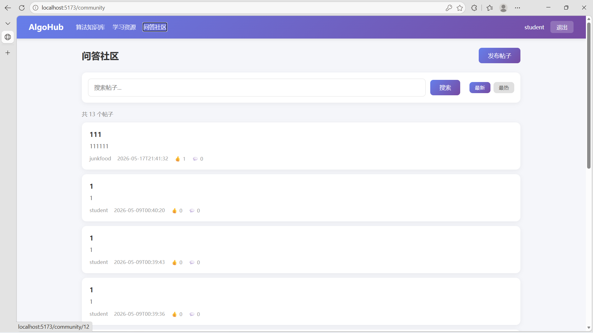
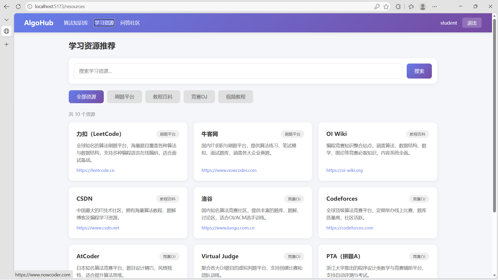
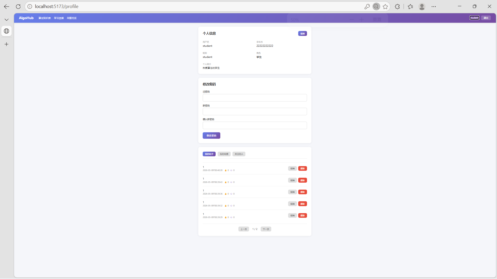
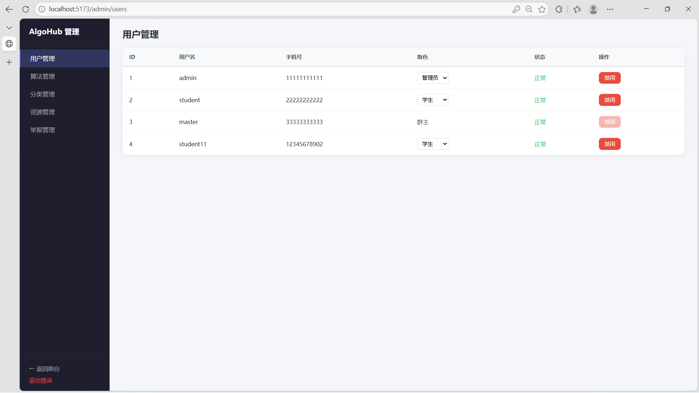
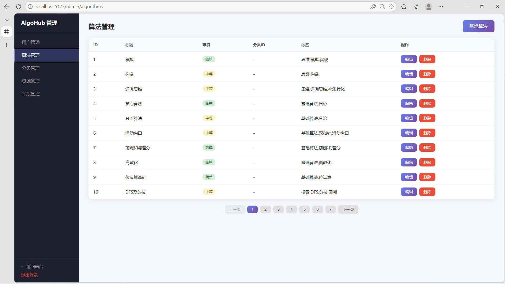
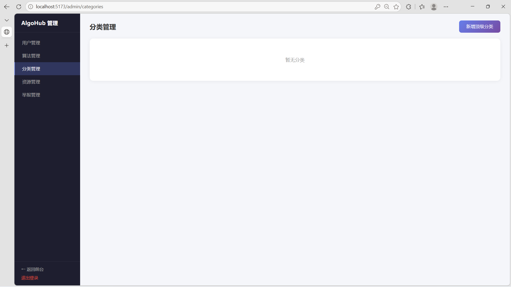
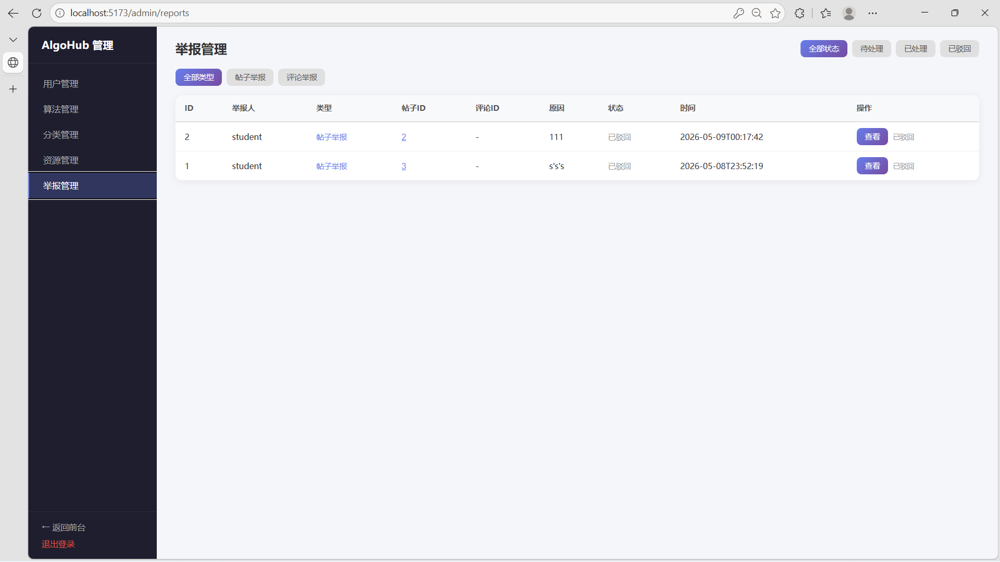
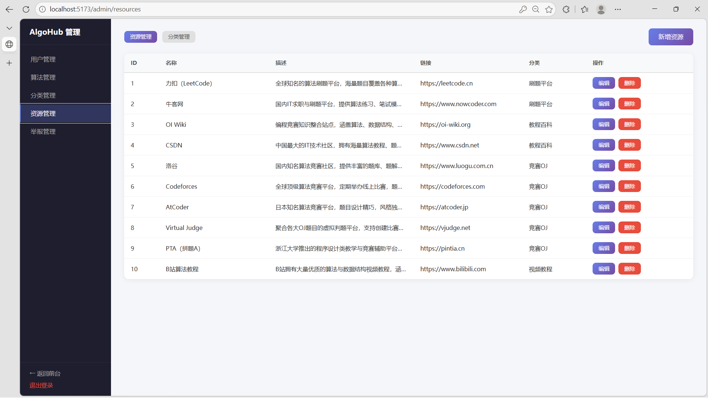

# 48组- AlgoHub 算法学习一站式服务平台

> 本文档为 48组 AlgoHub 算法学习一站式服务平台的最终软件说明书，涵盖项目概述、需求分析、系统设计、系统实现、系统测试、用户手册与项目总结七个章节。

---

## 基本信息

**项目名称：** 48组- AlgoHub 算法学习一站式服务平台
**学    院：** 创业学院
**小组序号：** 48
**成员姓名：** 常宇杰 / 李艺萱 / 章恒福 / 郑新杰 / 尹冰洁
**指导老师：** 尹兆远
**当前版本：** 结项版 V1.2
**更新日期：** 2026年5月17日

---

## 一、项目概述

### 1. 项目背景

在AI快速发展的背景下，简单的编程任务逐渐被自动化工具替代。为了提升大学生的核心竞争力，我们小组开发了AlgoHub——一个面向在校计算机专业大学生的算法学习一站式服务平台，帮助同学们提升编码思维与算法能力，从容应对技术变革。

项目应用场景覆盖：日常课程算法学习、算法竞赛备赛训练、校招笔试面试刷题。

### 2. 系统目标

优先完成用户体系、算法知识库、学习资源推荐、问答社区四大核心模块，确保平台具备基本的用户管理、算法知识检索、学习资源获取和社区交流能力。

系统已完成全部四大核心模块开发：用户体系（注册、登录、个人信息管理、三级角色权限控制、忘记密码）、算法知识库（分类浏览、关键词搜索、算法详情展示、C++模板代码一键复制、难度筛选）、学习资源推荐（分类筛选、关键词搜索、资源详情外链跳转）、问答社区（帖子发布/编辑/删除、评论回复、点赞收藏关注、内容举报），以及管理后台（用户管理、算法管理、分类管理、资源管理、举报管理、内容管理）。系统前后端完整可运行，共 10 张数据库表、43 个 RESTful API 接口、90 个测试用例，已通过全模块功能测试与安全测试。

### 3. 开发环境

| 类别 | 技术选型 |
|------|----------|
| 前端框架 | React 18 + TypeScript + Vite |
| 前端路由 | React Router v6 |
| 前端状态管理 | Context API |
| 后端框架 | Spring Boot 4.0.6 (Java 17) |
| 数据持久层 | Spring Data JPA (Hibernate) |
| 身份认证 | 自实现 JWT 认证 + 拦截器 |
| 数据库 | MySQL 8.0 (InnoDB, utf8mb4) |
| 连接池 | HikariCP |
| 项目管理 | Maven |
| 版本控制 | Git + GitHub |
| 开发工具 | VS Code |

---

## 二、需求分析

### 1. 功能需求

系统包括四大核心功能模块：

**（1）用户体系（已完整实现）**

| 功能 | 说明 | 状态 |
|------|------|------|
| 用户注册 | 用户名 + 密码 + 手机号 + 昵称注册，默认分配"学生"角色 | 已完成 |
| 用户登录 | 用户名 + 密码 + 角色选择登录，生成 JWT 令牌，"记住我"延长至 7 天 | 已完成 |
| 个人信息管理 | 查看/修改昵称、手机号、个人简介；修改密码需验证原密码 | 已完成 |
| 角色权限控制 | 预设"学生""管理员""群主"三级角色，前端隐藏无权限入口，后端接口校验，不可操作同级或更高级用户 | 已完成 |
| 忘记密码 | 手机号验证重置密码 | 已完成 |

**（2）算法知识库（已完整实现）**

| 功能 | 说明 | 状态 |
|------|------|------|
| 分类浏览 | 两级树形目录，8 个顶级分类 + 53 个子分类 | 已完成 |
| 算法搜索 | 按关键词模糊匹配算法标题 | 已完成 |
| 算法详情 | 算法简介、用法说明、C++ 模板代码 | 已完成 |
| 代码复制 | 一键复制 C++ 模板代码 | 已完成 |
| 难度筛选 | 简单 / 中等 / 困难三维筛选 | 已完成 |
| 知识点关联跳转 | 自动识别内容中提及的其他知识点并生成跳转链接 | 待实现 |

**（3）学习资源推荐（已完整实现）**

| 功能 | 说明 | 状态 |
|------|------|------|
| 分类浏览 | 按刷题平台、教程百科、竞赛OJ、视频教程四大分类筛选 | 已完成 |
| 关键词搜索 | 按关键词模糊匹配资源标题和描述，支持分页 | 已完成 |
| 资源详情 | 资源名称、简介、链接跳转、分类标签展示 | 已完成 |
| 管理后台 | 管理员对资源和分类进行增删改操作 | 已完成 |

**（4）问答社区（已完整实现）**

| 功能 | 说明 | 状态 |
|------|------|------|
| 帖子管理 | 发布帖子（标题+内容）、编辑、删除（仅作者/管理员） | 已完成 |
| 帖子列表 | 按时间/热度排序，关键词搜索，分页展示 | 已完成 |
| 评论系统 | 发表评论、回复评论（嵌套）、删除评论 | 已完成 |
| 点赞互动 | 帖子点赞/取消点赞（toggle式） | 已完成 |
| 收藏功能 | 帖子收藏/取消收藏，收藏列表分页查看 | 已完成 |
| 帖子关注 | 关注/取消关注帖子 | 已完成 |
| 用户关注 | 关注/取消关注其他用户，查看关注列表 | 已完成 |
| 内容举报 | 举报帖子/评论，填写举报原因 | 已完成 |
| 我的帖子 | 个人中心管理自己的帖子（编辑/删除） | 已完成 |
| 管理后台 | 查看举报列表、处理举报（删除内容/驳回）、管理员删除任意帖子/评论 | 已完成 |

**主要业务流程：**

```
未登录用户 → 注册账号 → 登录系统 → 获取JWT令牌
    → 浏览算法知识库（分类浏览/关键词搜索/难度筛选）
    → 查看算法详情（简介 + 用法说明 + C++模板代码 + 一键复制）
    → 浏览学习资源（分类筛选/关键词搜索/外链跳转）
    → 问答社区互动（浏览帖子/发布帖子/评论回复/点赞收藏关注）
    → 修改个人信息/修改密码/管理我的帖子/查看收藏
管理员 → 除学生权限外 → 用户管理（分页列表/启用禁用/角色变更）
    → 算法管理（增删改算法条目 + 分类管理）
    → 资源管理（增删改资源条目 + 分类管理）
    → 举报管理（查看举报列表/处理删除/驳回举报/删除任意帖子评论）
```

### 2. 非功能需求

| 需求类型 | 具体指标 |
|----------|----------|
| 性能要求 | 登录/注册接口响应时间 ≤ 200ms；页面首屏加载时间 ≤ 1.5s；支持 50 人同时在线 |
| 安全要求 | 用户密码 BCrypt/MD5 加密存储；JWT 令牌有效期 24 小时（"记住我" 7 天）；敏感操作（修改密码）需验证原密码；输入 XSS 过滤与 SQL 防注入 |
| 兼容性要求 | 支持 Chrome 90+、Edge 90+ 浏览器；1920×1080 分辨率下界面无错乱 |
| 可用性要求 | 核心流程（注册→登录→修改信息→退出）成功率 100%；算法知识库浏览与搜索成功率 100%；无阻塞性 Bug |


---

## 三、系统设计  
### 1. 系统架构

#### 1.1 总体架构

本项目采用前后端分离的 B/S 架构，前端为独立的 SPA（单页应用），后端为 RESTful API 服务，前后端通过 HTTP/JSON 协议通信。系统整体分为四层：

| 层次 | 职责 | 核心技术 |
|------|------|----------|
| 表示层（Presentation） | 页面渲染、用户交互、表单验证 | React 18 + TypeScript + Vite |
| 服务层（Application） | 业务逻辑处理、权限校验、JWT 认证 | Spring Boot 4.0.6 |
| 持久层（Persistence） | 数据访问与对象关系映射 | Spring Data JPA (Hibernate) |
| 数据层（Database） | 结构化数据存储 | MySQL 8.0 (InnoDB) |

架构设计遵循以下原则：
- **关注点分离**：前端专注 UI 交互，后端专注业务逻辑与数据管理
- **RESTful 风格**：资源导向的 API 设计，统一 JSON 响应格式 `{ code, message, data }`
- **无状态认证**：基于 JWT Bearer Token 的身份认证，服务端不存储会话
- **三层解耦**：后端按 Controller → Service → Repository 分层，各层职责明确

#### 1.2 架构图


```
┌──────────────────────────────────────────────────────────────────────┐
│                        客户端 (Browser)                               │
│                   http://localhost:5173                               │
│                                                                       │
│   ┌──────────┐ ┌──────────┐ ┌──────────────┐ ┌──────────────────┐  │
│   │  Login   │ │ Community│ │AlgorithmDetail│ │  Admin Panel     │  │
│   │ Register │ │ (问答社区)│ │  (算法详情  )  │ │ (用户/算法/分类  │  │
│   │          │ │          │ │               │ │  资源/举报管理)  │  │
│   └────┬─────┘ └────┬─────┘ └──────┬───────┘ └────────┬─────────┘  │
│        │             │              │                   │             │
│   ┌────┴─────────────┴──────────────┴───────────────────┴─────────┐ │
│   │          Resources │ PostDetail │ Profile(我的帖子)              │ │
│        │             │              │                   │             │
│   ┌────┴─────────────┴──────────────┴───────────────────┴─────────┐ │
│   │                    Fetch API (HTTP Client)                      │ │
│   │   - 请求拦截：自动附加 Authorization: Bearer <JWT>              │ │
│   │   - 响应拦截：401 → 清除 token → 重定向 /login                   │ │
│   └────────────────────────────┬───────────────────────────────────┘ │
└────────────────────────────────┼─────────────────────────────────────┘
                                 │  HTTP/JSON (REST API)
                     Vite Proxy: /api → localhost:8080
                                 │
┌────────────────────────────────┼─────────────────────────────────────┐
│                        服务端 (Spring Boot)                           │
│                                 │                                     │
│   ┌────────────────────────────▼───────────────────────────────────┐ │
│   │                   WebConfig (拦截器注册)                         │ │
│   │         放行：/api/user/login, /api/user/register,              │ │
│   │               /api/algorithm/**                                 │ │
│   │         拦截：其余 /api/** 需 JWT 校验                           │ │
│   └────────────────────────────┬───────────────────────────────────┘ │
│                                 │                                     │
│   ┌────────────────────────────▼───────────────────────────────────┐ │
│   │                  JwtInterceptor (JWT 认证)                       │ │
│   │   1. 提取 Authorization: Bearer <token>                         │ │
│   │   2. 解析 JWT → userId, username, role                          │ │
│   │   3. 将用户信息写入 request attributes                           │ │
│   │   4. 失败 → 返回 401 JSON                                       │ │
│   └────────────────────────────┬───────────────────────────────────┘ │
│                                 │                                     │
│   ┌────────────────────────────▼───────────────────────────────────┐ │
│   │                     Controller 层 (REST API)                    │ │
│   │                                                                  │ │
│   │  UserController           AlgorithmController                   │ │
│   │  POST /api/user/register  GET  /api/algorithm/categories       │ │
│   │  POST /api/user/login     GET  /api/algorithm/{id}             │ │
│   │  GET  /api/user/profile   GET  /api/algorithm/search           │ │
│   │  PUT  /api/user/profile   GET  /api/algorithm/category/{cid}   │ │
│   │  PUT  /api/user/password  GET  /api/algorithm/difficulty/{d}   │ │
│   │  POST /api/user/forgot                                          │ │
│   │                                                                  │ │
│   │  PostController            ResourceController                   │ │
│   │  GET/POST /api/posts       GET  /api/resources/categories       │ │
│   │  GET /api/posts/search     GET  /api/resources/{id}             │ │
│   │  GET /api/posts/my         GET  /api/resources/search           │ │
│   │  GET /api/posts/favorites  GET  /api/resources/category/{cid}  │ │
│   │  GET /api/posts/{id}                                             │ │
│   │  POST /posts/{id}/like                                          │ │
│   │  /favorite /follow /report                                      │ │
│   │  GET/POST /posts/{id}/comments                                  │ │
│   │                                                                  │ │
│   │  AdminController    AlgorithmAdmin    PostAdmin   ResourceAdmin  │ │
│   │  GET /api/admin/     POST /api/admin/  GET /api/    POST /api/   │ │
│   │  users               algorithm         admin/       admin/       │ │
│   │  PUT .../{id}/       PUT .../{id}      reports      resources    │ │
│   │  status & role       DELETE .../{id}   PUT .../     PUT .../{id} │ │
│   │                       category CRUD     resolve      DELETE      │ │
│   │                                        /dismiss     category CRUD│ │
│   └────────────────────────────┬───────────────────────────────────┘ │
│                                 │                                     │
│   ┌────────────────────────────▼───────────────────────────────────┐ │
│   │                     Service 层 (业务逻辑)                        │ │
│   │                                                                  │ │
│   │  UserServiceImpl              AlgorithmServiceImpl              │ │
│   │  - 注册参数校验（用户名3-20位、  - 分类树构建（自引用递归）       │ │
│   │    密码6-20位、手机号11位）     - 关键词搜索（JPQL LIKE 模糊匹配）│ │
│   │  - 密码MD5哈希校验              - 分类/难度多维度筛选             │ │
│   │  - 唯一性检查（用户名/手机号）  - 算法详情查询与 CRUD            │ │
│   │  - JWT Token 签发（24h/7天）   - 管理员后台增删改               │ │
│   │  - 个人信息修改与密码变更                                        │ │
│   │  - 手机号验证重置密码                                            │ │
│   │                                                                  │ │
│   │  PostServiceImpl              ResourceServiceImpl               │ │
│   │  - 帖子CRUD + 分页+排序        - 分类列表查询                    │ │
│   │  - 关键词搜索（标题+内容）      - 关键词搜索（标题+描述）         │ │
│   │  - Toggle点赞/收藏/关注        - 按分类筛选+分页                 │ │
│   │  - 评论CRUD + 嵌套回复         - 资源CRUD（管理员）              │ │
│   │  - 举报提交与管理员审核         - 分类CRUD（管理员）              │ │
│   │  - 用户关注 + 关注列表                                          │ │
│   │  - 管理员删除任意帖子/评论                                       │ │
│   └────────────────────────────┬───────────────────────────────────┘ │
│                                 │                                     │
│   ┌────────────────────────────▼───────────────────────────────────┐ │
│   │                    Repository 层 (数据访问)                      │ │
│   │                                                                  │ │
│   │  UserRepository               AlgorithmRepository               │ │
│   │  extends JpaRepository        extends JpaRepository             │ │
│   │  - findByUsername()           - findByCategoryIdOrderBy...()    │ │
│   │  - findByPhone()              - searchByKeyword(@Query JPQL)    │ │
│   │  - existsByUsername()         - findByDifficulty()              │ │
│   │  - findByRole()                                                 │ │
│   │                                                                  │ │
│   │  AlgorithmCategoryRepository  ResourceRepository                │ │
│   │  - findByParentIdIsNull()     - searchByKeyword(@Query JPQL)    │ │
│   │  - findByParentId()           - findByCategoryIdOrderBy...()    │ │
│   │                                                                  │ │
│   │  PostRepository               CommentRepository                 │ │
│   │  - searchByKeyword(JPQL)      - findByPostIdOrderBy...()        │ │
│   │  - incr/decrLikeCount         - countByPostId()                 │ │
│   │  - syncCommentCount           - findByPostId()                  │ │
│   │                                                                  │ │
│   │  PostLike/Favorite/Follow/    PostReportRepository              │ │
│   │  UserFollow Repository        - findByStatusOrderBy...()        │ │
│   │  - toggle式查询+删除          - deleteByPostId/CommentId()      │ │
│   └────────────────────────────┬───────────────────────────────────┘ │
│                                 │                                     │
│   ┌────────────────────────────▼───────────────────────────────────┐ │
│   │              GlobalExceptionHandler (全局异常处理)               │ │
│   │  统一捕获所有未处理异常，返回 Result { code, message, data } JSON│ │
│   └─────────────────────────────────────────────────────────────────┘ │
└────────────────────────────────────┬──────────────────────────────────┘
                                     │  JDBC (mysql-connector-j)
                                     │  HikariCP 连接池
                                     ▼
┌──────────────────────────────────────────────────────────────────────┐
│                        MySQL 8.0 (login_db)                             │
│                                                                         │
│   ┌──────────────┐  ┌──────────────────────┐  ┌───────────────────┐   │
│   │    users     │  │ algorithm_categories │  │    algorithms     │   │
│   │              │  │                      │  │                   │   │
│   │ id (PK)      │  │ id (PK)              │  │ id (PK)           │   │
│   │ username     │  │ name                 │  │ title             │   │
│   │ password     │  │ parent_id (FK→本表)   │──│ category_id (FK)  │   │
│   │ phone        │  │ sort_order           │  │ description       │   │
│   │ role(3级)    │  │ create_time          │  │ usage_intro       │   │
│   │ locked       │  │ children (递归)       │  │ cpp_template      │   │
│   └──────┬───────┘  └──────────────────────┘  │ difficulty        │   │
│          │                                    │ tags              │   │
│          │ FK (user_id)                       └───────────────────┘   │
│          │                                                            │
│   ┌──────┴──────────────────────────────────────────────────────┐    │
│   │              问答社区 (7 tables)                              │    │
│   │  posts │ comments │ post_likes │ post_favorites              │    │
│   │  post_follows │ user_follows │ post_reports                 │    │
│   └──────────────────────────────────────────────────────────────┘    │
│                                                                         │
│   ┌──────────────────────┐  ┌───────────────────┐                      │
│   │  resource_categories │  │     resources     │                      │
│   │  id (PK), name       │  │ id (PK), title    │                      │
│   │  sort_order          │──│ url, description  │                      │
│   └──────────────────────┘  │ category_id (FK)  │                      │
│                             └───────────────────┘                      │
│   引擎：InnoDB  字符集：utf8mb4  外键：CASCADE (社区) / SET NULL (算法) │
└──────────────────────────────────────────────────────────────────────┘
```

#### 1.3 请求处理流程

以一次典型的"登录后浏览算法详情"的完整链路为例：

```
步骤1: POST /api/user/login  { username, password, role, rememberMe }
  ├─ UserController.login()
  ├─ UserServiceImpl.login()
  │   ├─ userRepo.findByUsername()       → SELECT * FROM users WHERE username=?
  │   ├─ password 校验（安全哈希比对）
  │   ├─ locked 状态检查
  │   ├─ role 角色匹配校验
  │   └─ jwtUtil.generateToken()         → HS256 签发 JWT (含 userId/username/role)
  └─ 返回 { code:200, data:{ token, userInfo } }

步骤2: 前端存储 token 到 localStorage，跳转首页
  └─ 请求拦截器自动为后续所有请求附加 Authorization: Bearer <token>

步骤3: GET /api/algorithm/categories  (获取分类树)
  ├─ JwtInterceptor 放行 (/api/algorithm/** 在白名单中)
  ├─ AlgorithmController.getCategories()
  └─ AlgorithmServiceImpl.getCategoryTree()
      └─ categoryRepo.findByParentIdIsNull() → 顶级分类 + JPA 懒加载 children

步骤4: GET /api/algorithm/search?keyword=  (获取全部算法列表)
  └─ AlgorithmServiceImpl.searchAlgorithms("")
      └─ algorithmRepo.searchByKeyword("")  → JPQL: WHERE title LIKE '%%' ORDER BY createTime DESC

步骤5: GET /api/algorithm/1  (获取"快速排序"算法详情)
  └─ AlgorithmServiceImpl.getAlgorithmDetail(1)
      └─ algorithmRepo.findById(1)  → 返回含 C++ 模板代码的完整算法对象
```

#### 1.4 安全架构

```
┌───────────────────────────────────────────────┐
│                 安全模型                        │
│                                                │
│  公开接口（无需认证）                            │
│  ├── POST /api/user/register                   │
│  ├── POST /api/user/login                      │
│  ├── POST /api/user/forgot-password            │
│  ├── GET  /api/algorithm/**                    │
│  ├── GET  /api/resources/**                    │
│  ├── GET  /api/posts/**                        │
│  ├── GET  /api/comments/**                     │
│  └── POST /api/users/*/follow                  │
│                                                │
│  认证接口（需有效 JWT）                          │
│  ├── GET/PUT /api/user/profile                 │
│  ├── PUT /api/user/password                   │
│  ├── POST/PUT/DELETE /api/posts/**             │
│  └── POST/DELETE /api/comments/**              │
│                                                │
│  授权接口（需 JWT + role=ADMIN 或 MASTER）       │
│  ├── ALL /api/admin/**                         │
│  │   ├── 用户管理：ADMIN+可操作下级用户           │
│  │   ├── 角色变更：仅 MASTER 可修改他人角色       │
│  │   └── 内容管理：ADMIN+可删除任意帖子/评论     │
│                                                │
│  Token 策略：                                   │
│  - 签名算法：HS256                              │
│  - 有效期：默认 24h / "记住我" 7 天              │
│  - 载荷：{ userId, username, role, exp }        │
│  - 存储：前端 localStorage                      │
│  - 传输：Authorization: Bearer <token> Header  │
│                                                │
│  权限层级保护：                                  │
│  - roleLevel: MASTER(3) > ADMIN(2) > STUDENT(1)│
│  - 不可操作同级或更高级别用户                     │
│  - MASTER 角色不可被任何管理员修改               │
│                                                │
│  前端安全：                                     │
│  - ProtectedRoute: 检查 token 存在性            │
│  - AdminLayout: 检查 role !== 'STUDENT'         │
│  - 响应拦截器: 401 → 清除 token → 跳转登录       │
└───────────────────────────────────────────────┘
```

### 2. 模块设计

#### 2.1 模块总览

系统目前包含四大功能模块和一个管理后台模块：

```
AlgoHub 系统
│
├── 1. 用户模块 (User Module)
│   ├── 1.1 用户注册（用户名/密码/手机号/昵称）
│   ├── 1.2 用户登录 / JWT 认证（"记住我" 7天）
│   ├── 1.3 个人信息管理（查看/修改资料/修改密码）
│   ├── 1.4 忘记密码（手机号验证重置密码）
│   └── 1.5 角色权限控制（STUDENT / ADMIN / MASTER 三级）
│
├── 2. 算法知识库模块 (Algorithm Knowledge Base)
│   ├── 2.1 分类浏览（两级树形目录，8 大类 53 子类）
│   ├── 2.2 算法搜索（按关键词 / 分类 / 难度三维筛选）
│   ├── 2.3 算法详情展示（简介 / 用法说明 / C++ 模板代码）
│   └── 2.4 代码一键复制
│
├── 3. 学习资源推荐模块 (Learning Resources)
│   ├── 3.1 分类筛选（刷题平台/教程百科/竞赛OJ/视频教程）
│   ├── 3.2 关键词搜索（按标题和描述模糊匹配）
│   └── 3.3 资源详情（名称/简介/外链跳转）
│
├── 4. 问答社区模块 (Q&A Community)
│   ├── 4.1 帖子管理（发布/编辑/删除/按时间热度排序/搜索）
│   ├── 4.2 评论系统（评论回复/嵌套评论/删除评论）
│   ├── 4.3 互动功能（点赞/收藏/关注帖子/关注用户）
│   ├── 4.4 内容举报（举报帖子或评论）
│   └── 4.5 个人帖子管理（我的帖子/我的收藏）
│
└── 5. 管理后台模块 (Admin Panel)
    ├── 5.1 用户管理（分页列表/启用禁用/角色变更）
    ├── 5.2 算法管理（算法CRUD + 分类树管理）
    ├── 5.3 资源管理（资源CRUD + 分类管理）
    ├── 5.4 举报管理（举报列表/处理删除/驳回举报）
    └── 5.5 内容管理（管理员删除任意帖子/评论）
```

#### 2.2 模块交互关系

```
                    ┌──────────────────┐
                    │     管理后台      │
                    │    (Admin)       │
                    │                  │
                    │ 用户管理  ──────── 管理 users 表（分页/禁用/角色变更）
                    │ 算法 CRUD ──────── 管理 algorithms 表（增删改+分类）
                    │ 资源 CRUD ──────── 管理 resources 表（增删改+分类）
                    │ 举报管理  ──────── 查看举报/处理删除/驳回举报
                    │ 内容管理  ──────── 管理员删除任意帖子/评论
                    └────────┬─────────┘
                             │ 依赖认证模块提供 JWT 校验 + 角色判断
                    ┌────────▼─────────┐
                    │     用户模块      │
                    │    (User)        │
                    │                  │
                    │ 注册 / 登录 ────── JWT 签发（HS256，含角色信息）
                    │ 个人信息    ────── users 表 CRUD
                    │ 忘记密码    ────── 手机号验证重置
                    │ 角色权限    ────── STUDENT/ADMIN/MASTER 三级
                    └────────┬─────────┘
                             │ 提供认证信息
          ┌──────────────────┼──────────────────┐
          │                  │                  │
  ┌───────▼───────┐  ┌───────▼───────┐  ┌───────▼───────────┐
  │   算法知识库   │  │  学习资源推荐  │  │    问答社区         │
  │  (Algorithm)  │  │  (Resource)   │  │   (Post)           │
  │               │  │               │  │                    │
  │ 分类浏览 ──── │  │ 分类筛选 ──── │  │ 帖子CRUD ───────── │
  │ algorithm_    │  │ resource_     │  │ posts + likes +    │
  │ categories    │  │ categories    │  │ favorites+follows  │
  │ (自引用树)    │  │ (平级分类)    │  │                    │
  │               │  │               │  │ 评论系统 ───────── │
  │ 算法搜索 ──── │  │ 资源搜索 ──── │  │ comments           │
  │ JPQL LIKE     │  │ JPQL LIKE     │  │ (嵌套回复)          │
  │               │  │               │  │                    │
  │ 算法详情 ──── │  │ 资源详情 ──── │  │ 举报系统 ───────── │
  │ C++ 模板代码  │  │ 外链跳转      │  │ post_reports       │
  │               │  │               │  │ (PENDING/RESOLVED) │
  │ 难度筛选 ──── │  │               │  │                    │
  │ easy/med/hard │  │               │  │ 用户关注 ───────── │
  │               │  │               │  │ user_follows       │
  └───────────────┘  └───────────────┘  └────────────────────┘
```

#### 2.3 前后端模块对应关系

| 前端页面 | 后端 Controller | 操作的数据表 |
|----------|-----------------|-------------|
| pages/Login.tsx | UserController.login() | users |
| pages/Register.tsx | UserController.register() | users |
| pages/Home.tsx | AlgorithmController (search/categories) | algorithms, algorithm_categories |
| pages/AlgorithmDetail.tsx | AlgorithmController.getDetail() | algorithms |
| pages/Resources.tsx | ResourceController (search/categories/detail) | resources, resource_categories |
| pages/Community.tsx | PostController (listPosts/searchPosts) | posts |
| pages/PostDetail.tsx | PostController (getDetail/comments/like/favorite/follow/report) | posts, comments, post_likes, post_favorites, post_follows |
| pages/Profile.tsx | UserController + PostController (myPosts/favorites) | users, posts, post_favorites |
| pages/admin/UserManagement.tsx | AdminController (listUsers/toggleStatus/changeRole) | users |
| pages/admin/AlgorithmManagement.tsx | AlgorithmAdminController (CRUD + category CRUD) | algorithms, algorithm_categories |
| pages/admin/ResourceManagement.tsx | ResourceAdminController (CRUD + category CRUD) | resources, resource_categories |
| pages/admin/ReportManagement.tsx | PostAdminController (getReports/resolve/dismiss) | post_reports, posts, comments |

#### 2.4 前端组件层级

```
<BrowserRouter>
  <App>
    <Routes>
      ├── /login          → <Login />              (公开)
      ├── /register       → <Register />           (公开)
      ├── <ProtectedRoute>                          (路由守卫：检查 token)
      │   ├── <Layout>                              (主布局：顶部导航)
      │   │   ├── /              → <Home />         (默认首页 - 问答社区)
      │   │   ├── /algorithm/:id → <AlgorithmDetail />
      │   │   ├── /resources     → <Resources />    (学习资源页)
      │   │   ├── /post/:id      → <PostDetail />   (帖子详情页)
      │   │   └── /profile       → <Profile />      (个人信息 + 我的帖子)
      │   │
      │   └── <AdminLayout>                        (管理布局：侧边栏导航)
      │       ├── /admin/users       → <UserManagement />
      │       ├── /admin/algorithms  → <AlgorithmManagement />
      │       ├── /admin/categories  → <CategoryManagement />
      │       ├── /admin/resources   → <ResourceManagement />
      │       └── /admin/reports     → <ReportManagement />
      └── *              → Navigate to /login       (通配符重定向)
```

### 3. 数据库设计

#### 3.1 E-R 图



```
┌──────────────────────────────────────────────────────────────────────────┐
│                           数据库 ER 关系                                   │
│                                                                           │
│  ┌──────────────────────┐                                                 │
│  │        users         │    ← 核心实体，各模块通过 user_id 外键关联       │
│  ├──────────────────────┤                                                 │
│  │ id (PK, BIGINT)      │───┐                                             │
│  │ username (UNIQUE)    │   │                                             │
│  │ password (MD5哈希)   │   │  ┌──────────────────────────────┐          │
│  │ phone (UNIQUE)       │   │  │    resource_categories       │          │
│  │ nickname             │   │  ├──────────────────────────────┤          │
│  │ intro                │   │  │ id (PK)                      │          │
│  │ role (STUDENT/ADMIN/  │  │  │ name                         │          │
│  │        MASTER)       │   │  │ sort_order                   │          │
│  │ locked (0/1)         │   │  └──────────┬───────────────────┘          │
│  │ create_time          │   │             │ 1 : N                        │
│  │ update_time          │   │  ┌──────────▼───────────────────┐          │
│  └───────┬──────────────┘   │  │         resources            │          │
│          │                  │  ├──────────────────────────────┤          │
│          │ 1 : N            │  │ id (PK)                      │          │
│          │                  │  │ title, description, url      │          │
│  ┌───────┴────────────────┐ │  │ category_id (FK)             │          │
│  │  algorithm_categories  │ │  │ sort_order                   │          │
│  ├────────────────────────┤ │  └──────────────────────────────┘          │
│  │ id (PK, BIGINT)    ────┤┘│                                             │
│  │ name (VARCHAR 50)      │  │  ┌──────────────────────────────┐          │
│  │ parent_id (FK→本表)    │◀─┘  │           posts              │          │
│  │ sort_order (INT)       │ 自引用├──────────────────────────────┤          │
│  │ create_time            │     │ id (PK)                      │          │
│  └────────┬───────────────┘     │ title, content               │          │
│           │ 1 : N               │ user_id (FK→users)           │◄─────────┤
│  ┌────────▼───────────────┐     │ like_count, comment_count    │          │
│  │      algorithms        │     │ create_time, update_time     │          │
│  ├────────────────────────┤     └──┬───┬───────┬───────┬──────┘          │
│  │ id (PK, BIGINT)        │        │   │       │       │                  │
│  │ title (VARCHAR 100)    │        │   │       │       │                  │
│  │ description (TEXT)     │   ┌────┘   │       │       │                  │
│  │ usage_intro (TEXT)     │   │  ┌─────┘       │       │                  │
│  │ cpp_template (TEXT)    │   │  │    ┌────────┘       │                  │
│  │ category_id (FK)       │   │  │    │       ┌────────┘                  │
│  │ difficulty (VARCHAR)   │   │  │    │       │                           │
│  │ tags (VARCHAR 255)     │   ▼  ▼    ▼       ▼                           │
│  │ create_time, update_time│ ┌──────┐┌────────┐┌──────────┐┌──────────┐ │
│  └────────────────────────┘ │comment││post_   ││post_     ││post_     │ │
│                             │      ││likes   ││favorites ││follows   │ │
│  ┌──────────────────────┐   │post_id││post_id ││post_id   ││post_id   │ │
│  │      user_follows    │   │user_id││user_id ││user_id   ││user_id   │ │
│  ├──────────────────────┤   │parent ││UNIQUE  ││UNIQUE    ││UNIQUE    │ │
│  │ follower_id (FK)     │   │_id    ││(post,  ││(post,    ││(post,    │ │
│  │ followed_id (FK)     │   │content││user)   ││user)     ││user)     │ │
│  │ UNIQUE(follower,     │   └──────┘└────────┘└──────────┘└──────────┘ │
│  │         followed)    │                                                │
│  └──────────────────────┘   ┌──────────────────────────────┐             │
│                             │        post_reports          │             │
│                             ├──────────────────────────────┤             │
│                             │ post_id / comment_id         │             │
│                             │ reporter_id (FK→users)       │             │
│                             │ reason, status (PENDING/     │             │
│                             │   RESOLVED/DISMISSED)        │             │
│                             │ handler_id, handle_note      │             │
│                             └──────────────────────────────┘             │
│                                                                           │
│  外键策略：ON DELETE CASCADE (社区模块) / ON DELETE SET NULL (算法模块)    │
│                                                                           │
│  设计说明：                                                                │
│  - users 角色内联（role 字段），role 三级: STUDENT/ADMIN/MASTER            │
│  - algorithm_categories 通过 parent_id 自引用实现无限层级树                 │
│  - 社区模块7张表通过外键级联，删除帖子时同步清理关联数据                      │
│  - post_likes / post_favorites / post_follows 均设 (post_id,user_id) 联合  │
│    唯一索引，防止重复操作，toggle 式交互无需额外状态管理                      │
└──────────────────────────────────────────────────────────────────────────┘
```

#### 3.2 主要数据表设计

**users 表（用户表）**

| 字段名 | 类型 | 约束 | 说明 |
|--------|------|------|------|
| id | BIGINT | PK, AUTO_INCREMENT | 主键 |
| username | VARCHAR(20) | NOT NULL, UNIQUE | 用户名，3-20 字符 |
| password | VARCHAR(255) | NOT NULL | 密码（MD5哈希存储） |
| phone | VARCHAR(11) | NOT NULL, UNIQUE | 手机号，11 位数字 |
| nickname | VARCHAR(255) | — | 昵称 |
| intro | VARCHAR(255) | — | 个人简介 |
| role | VARCHAR(20) | NOT NULL, DEFAULT 'STUDENT' | 角色：STUDENT / ADMIN / MASTER |
| locked | INT | NOT NULL, DEFAULT 0 | 锁定状态（0=正常, 1=禁用） |
| create_time | DATETIME | — | 创建时间 |
| update_time | DATETIME | — | 更新时间 |

索引：
- PRIMARY KEY: `id`
- UNIQUE KEY `uk_username`: `username`
- UNIQUE KEY `uk_phone`: `phone`

**algorithm_categories 表（算法分类表）**

| 字段名 | 类型 | 约束 | 说明 |
|--------|------|------|------|
| id | BIGINT | PK, AUTO_INCREMENT | 主键 |
| name | VARCHAR(50) | NOT NULL | 分类名称 |
| parent_id | BIGINT | FK → algorithm_categories.id, ON DELETE SET NULL | 父分类 ID（NULL=顶级分类） |
| sort_order | INT | DEFAULT 0 | 同级排序序号 |
| create_time | DATETIME | DEFAULT CURRENT_TIMESTAMP | 创建时间 |

索引：
- PRIMARY KEY: `id`
- FOREIGN KEY: `parent_id` → `algorithm_categories(id)` ON DELETE SET NULL

**algorithms 表（算法详情表）**

| 字段名 | 类型 | 约束 | 说明 |
|--------|------|------|------|
| id | BIGINT | PK, AUTO_INCREMENT | 主键 |
| title | VARCHAR(100) | NOT NULL | 算法名称 |
| description | TEXT | — | 算法简介 |
| usage_intro | TEXT | — | 使用场景/用法说明 |
| cpp_template | TEXT | — | C++ 模板代码 |
| category_id | BIGINT | FK → algorithm_categories.id, ON DELETE SET NULL | 所属分类 |
| difficulty | VARCHAR(20) | DEFAULT 'medium' | 难度：easy / medium / hard |
| tags | VARCHAR(255) | — | 标签，逗号分隔 |
| create_time | DATETIME | DEFAULT CURRENT_TIMESTAMP | 创建时间 |
| update_time | DATETIME | ON UPDATE CURRENT_TIMESTAMP | 自动更新时间 |

索引：
- PRIMARY KEY: `id`
- FOREIGN KEY: `category_id` → `algorithm_categories(id)` ON DELETE SET NULL

**resource_categories 表（资源分类表）**

| 字段名 | 类型 | 约束 | 说明 |
|--------|------|------|------|
| id | BIGINT | PK, AUTO_INCREMENT | 主键 |
| name | VARCHAR(50) | NOT NULL | 分类名称 |
| sort_order | INT | DEFAULT 0 | 排序序号 |
| create_time | DATETIME | — | 创建时间 |

**resources 表（学习资源表）**

| 字段名 | 类型 | 约束 | 说明 |
|--------|------|------|------|
| id | BIGINT | PK, AUTO_INCREMENT | 主键 |
| title | VARCHAR(100) | NOT NULL | 网站名称 |
| description | TEXT | — | 网站简介 |
| url | VARCHAR(255) | NOT NULL | 网站链接 |
| category_id | BIGINT | FK → resource_categories.id, ON DELETE SET NULL | 所属分类 |
| sort_order | INT | DEFAULT 0 | 排序序号 |
| create_time | DATETIME | — | 创建时间 |
| update_time | DATETIME | — | 更新时间 |

**posts 表（帖子表）**

| 字段名 | 类型 | 约束 | 说明 |
|--------|------|------|------|
| id | BIGINT | PK, AUTO_INCREMENT | 主键 |
| title | VARCHAR(100) | NOT NULL | 帖子标题 |
| content | TEXT | — | 帖子内容 |
| user_id | BIGINT | NOT NULL, FK → users.id ON DELETE CASCADE | 作者ID |
| like_count | INT | NOT NULL, DEFAULT 0 | 点赞数（冗余） |
| comment_count | INT | NOT NULL, DEFAULT 0 | 评论数（冗余） |
| create_time | DATETIME | — | 发布时间 |
| update_time | DATETIME | — | 更新时间 |

**comments 表（评论表）**

| 字段名 | 类型 | 约束 | 说明 |
|--------|------|------|------|
| id | BIGINT | PK, AUTO_INCREMENT | 主键 |
| post_id | BIGINT | NOT NULL, FK → posts.id ON DELETE CASCADE | 帖子ID |
| user_id | BIGINT | NOT NULL, FK → users.id ON DELETE CASCADE | 评论者ID |
| parent_id | BIGINT | — | 父评论ID（嵌套回复） |
| content | TEXT | NOT NULL | 评论内容 |
| create_time | DATETIME | — | 评论时间 |

**post_reports 表（举报记录表）**

| 字段名 | 类型 | 约束 | 说明 |
|--------|------|------|------|
| id | BIGINT | PK, AUTO_INCREMENT | 主键 |
| post_id | BIGINT | — | 被举报帖子ID |
| comment_id | BIGINT | — | 被举报评论ID |
| reporter_id | BIGINT | NOT NULL, FK → users.id | 举报人ID |
| reason | VARCHAR(200) | — | 举报原因 |
| status | VARCHAR(20) | NOT NULL, DEFAULT 'PENDING' | 状态：PENDING/RESOLVED/DISMISSED |
| handler_id | BIGINT | — | 处理人ID |
| handle_note | VARCHAR(200) | — | 处理备注 |
| create_time | DATETIME | — | 举报时间 |
| handle_time | DATETIME | — | 处理时间 |

#### 3.3 种子数据概览

| 表 | 记录数 | 内容 |
|----|--------|------|
| users | 3 条 | admin（管理员）/ student（学生）/ master（群主），默认密码 123456 |
| algorithm_categories | 61 条 | 8 个顶级分类 + 53 个子分类 |
| algorithms | 68 条 | 覆盖全部子分类，每条含完整 C++ 模板代码 |
| resource_categories | 4 条 | 刷题平台 / 教程百科 / 竞赛OJ / 视频教程 |
| resources | 10 条 | LeetCode、牛客、OI Wiki、CSDN、洛谷、Codeforces、AtCoder、Virtual Judge、PTA、B站 |
| posts / comments / post_likes / post_favorites / post_follows / user_follows / post_reports | 0 条（空表，种子数据未预置） | 7张社区表，通过应用运行时动态创建数据 |

分类覆盖范围：
- 基础算法（排序、二分、贪心、分治、双指针、前缀和、离散化、位运算）
- 搜索（DFS、BFS、双向BFS、回溯）
- 数据结构（并查集、哈希、单调栈/队列、线段树、树状数组、LCA、Trie、AC自动机、分块、莫队）
- 图论（最小生成树、最短路、拓扑排序、SCC、割点/边、二分图、欧拉路径、差分约束）
- 动态规划（背包、区间、树形、数位、状压、计数、概率DP）
- 字符串（KMP、Manacher）
- 数学（素数筛、欧拉函数、扩展GCD、中国剩余定理、快速幂、组合数、容斥、博弈论、高斯消元、线性基）
- 思维技巧（模拟、构造、逆向思维）

---

## 四、系统实现  【中期部分填写；结项补全】

### 1. 关键技术

#### 1.1 自实现 JWT 认证框架

项目未直接使用 Spring Security，而是自实现了基于拦截器的 JWT 认证与权限控制框架：

- **JwtUtil**：实现 HS256 签名算法的 Token 签发与解析，载荷包含 userId、username、role、exp
- **JwtInterceptor**：拦截所有 `/api/**` 请求（白名单除外），从 Authorization Header 提取 Token，解析后将用户信息写入 request attributes
- **WebConfig**：注册拦截器，配置白名单路径（登录、注册、算法公开浏览）
- **前端ProtectedRoute**：基于 Context API 的路由守卫，检查 token 存在性，401 时自动清除 token 并跳转登录页

#### 1.2 树形分类数据结构

算法分类采用数据库自引用设计，通过 `parent_id` 字段实现无限层级树：

- 顶级分类：`parent_id IS NULL`
- JPA 实体使用 `@ManyToOne` + `@OneToMany` 实现自引用关联
- Service 层通过递归/迭代构建树形 JSON 返回前端

#### 1.3 分页查询

使用 Spring Data JPA 的 `Pageable` 机制实现全平台统一分页：
- `PageResult.java` 封装通用分页响应结构 `{ list, total, page, pageSize }`
- 各模块 Controller 层统一使用 `@RequestParam(defaultValue)` 设置默认分页参数
- 用户管理、算法列表、帖子列表、评论列表、资源列表、举报列表均支持分页

#### 1.4 Toggle 式交互设计

点赞、收藏、关注帖子、关注用户等交互采用 toggle 模式：
- 数据库通过 `(user_id, target_id)` 联合唯一索引防止重复操作
- 业务层查询是否存在记录：存在则删除（取消），不存在则新增（执行）
- 幂等性强，前端可安全重复调用，无需维护额外状态

#### 1.5 举报与审核系统

社区内容审核采用举报驱动模式：
- 用户举报帖子或评论，提交原因，状态初始为 PENDING
- 管理员查看举报列表（支持按状态筛选），可选择"处理（resolve）"或"驳回（dismiss）"
- resolve 时自动删除被举报内容及其关联数据（评论、点赞、收藏、关注）
- 所有举报操作记录 handler_id 和 handle_time，支持追溯

### 2. 界面展示

系统已完成 13 个核心页面的开发，涵盖前台用户功能与后台管理功能，以下为实际运行截图：

**（1）算法知识库首页（/）—— 分类浏览 + 搜索 + 难度筛选**



**（2）问答社区首页（/）—— 帖子列表 + 排序 + 搜索**



**（3）学习资源推荐页（/resources）—— 分类筛选 + 资源卡片**



**（4）个人信息页（/profile）—— 资料编辑 + 修改密码 + 我的帖子管理**



**（5）管理后台 - 用户管理（/admin/users）—— 用户列表 + 启用/禁用 + 角色变更**



**（6）管理后台 - 算法管理（/admin/algorithms）—— 算法 CRUD**



**（7）管理后台 - 分类管理（/admin/categories）—— 树形分类 CRUD**



**（8）管理后台 - 举报管理（/admin/reports）—— 举报列表 + 处理/驳回**



**（9）管理后台 - 资源管理（/admin/resources）—— 资源与分类 CRUD**



### 3. 核心代码片段

以下按后端→前端的顺序，展示项目主要功能板块（用户认证、算法知识库、问答社区、前端路由与页面）的核心实现代码。

---

#### 3.1 后端核心代码

**（1）统一响应封装 —— Result.java + PageResult.java**

整个后端所有接口的返回值均通过 `Result<T>` 统一包装，分页数据通过 `PageResult<T>` 包装，确保前端能以统一格式解析响应。

```java
// Result.java —— 通用响应封装，code + msg + data 三段式结构
@Data
public class Result<T> {
    private int code;       // 状态码：200 成功 / 401 未登录 / 500 错误
    private String msg;     // 提示消息
    private T data;         // 响应数据（泛型，可以是对象、列表或分页结果）

    public static <T> Result<T> success() {
        Result<T> r = new Result<>();
        r.setCode(200);
        r.setMsg("操作成功");
        return r;
    }

    public static <T> Result<T> success(T data) {
        Result<T> r = new Result<>();
        r.setCode(200);
        r.setMsg("操作成功");
        r.setData(data);
        return r;
    }

    public static <T> Result<T> error(String msg) {
        Result<T> r = new Result<>();
        r.setCode(500);
        r.setMsg(msg);
        return r;
    }

    public static <T> Result<T> error(int code, String msg) {
        Result<T> r = new Result<>();
        r.setCode(code);
        r.setMsg(msg);
        return r;
    }
}

// PageResult.java —— 分页响应封装，用于列表类接口
@Data
public class PageResult<T> {
    private List<T> list;       // 当前页数据列表
    private long total;         // 总记录数（前端据此计算总页数）
    private int page;           // 当前页码
    private int pageSize;       // 每页条数

    public PageResult(List<T> list, long total, int page, int pageSize) {
        this.list = list;
        this.total = total;
        this.page = page;
        this.pageSize = pageSize;
    }
}
```

**（2）JWT 认证框架 —— JwtUtil.java + JwtInterceptor.java**

项目不使用 Spring Security，而是自实现基于拦截器的轻量级 JWT 认证框架：JwtUtil 负责 HS256 签名算法的 Token 签发与解析，JwtInterceptor 拦截所有 `/api/**` 请求完成身份校验。

```java
// JwtUtil.java —— JWT 令牌工具类：签发、解析、过期验证
@Component
public class JwtUtil {
    private final SecretKey KEY;  // HS256 签名密钥，构造时从 application.yml 配置注入

    public JwtUtil(@Value("${jwt.secret}") String secret) {
        this.KEY = Keys.hmacShaKeyFor(secret.getBytes());
    }

    private static final long DEFAULT_EXPIRATION = 24 * 60 * 60 * 1000;       // 默认 24h
    public static final long REMEMBER_ME_EXPIRATION = 7 * 24 * 60 * 60 * 1000; // "记住我" 7 天

    // 签发 JWT Token，载荷包含 userId / username / role 三级角色信息
    public String generateToken(Long userId, String username, String role, long expiration) {
        Map<String, Object> claims = new HashMap<>();
        claims.put("userId", userId);
        claims.put("username", username);
        claims.put("role", role);      // STUDENT / ADMIN / MASTER
        return Jwts.builder()
                .setClaims(claims)
                .setSubject(username)
                .setIssuedAt(new Date(System.currentTimeMillis()))
                .setExpiration(new Date(System.currentTimeMillis() + expiration))
                .signWith(KEY)          // HS256 签名
                .compact();
    }

    // 解析 Token 中的 Claims（包含 userId / username / role）
    public Claims extractClaims(String token) {
        return Jwts.parserBuilder().setSigningKey(KEY).build()
                .parseClaimsJws(token).getBody();
    }

    // 验证 Token 是否过期
    public boolean isTokenExpired(String token) {
        return extractClaims(token).getExpiration().before(new Date());
    }
}

// JwtInterceptor.java —— 请求拦截器：校验 Authorization Header，解析后注入 request
@Component
public class JwtInterceptor implements HandlerInterceptor {
    @Override
    public boolean preHandle(HttpServletRequest request, HttpServletResponse response,
                             Object handler) throws Exception {
        String token = request.getHeader("Authorization");
        if (token == null || !token.startsWith("Bearer ")) {
            setErrorResponse(response, Result.error(401, "未登录，请先登录"));
            return false;
        }
        token = token.substring(7);  // 去除 "Bearer " 前缀

        try {
            if (jwtUtil.isTokenExpired(token)) {
                setErrorResponse(response, Result.error(401, "登录已过期，请重新登录"));
                return false;
            }
            Claims claims = jwtUtil.extractClaims(token);
            request.setAttribute("userId", claims.get("userId", Long.class));
            request.setAttribute("username", claims.get("username", String.class));
            request.setAttribute("role", claims.get("role", String.class));
            return true;
        } catch (JwtException e) {
            setErrorResponse(response, Result.error(401, "登录状态异常，请重新登录"));
            return false;
        }
    }
}
```

**（3）问答社区 REST API —— PostController.java（核心接口精选）**

PostController 是项目中最具代表性的 Controller，涵盖帖子 CRUD、Toggle 式点赞/收藏/关注、评论嵌套回复、举报提交等 20 个接口。以下精选核心接口展示分层设计：

```java
@RestController
@RequestMapping("/api")
public class PostController {

    @Autowired
    private PostService postService;
    @Autowired
    private JwtUtil jwtUtil;

    // 从 Authorization Header 中提取 userId，未登录返回 null（用于公开可浏览接口）
    private Long getUserIdOrNull(HttpServletRequest request) {
        String auth = request.getHeader("Authorization");
        if (auth == null || !auth.startsWith("Bearer ")) return null;
        try {
            Claims claims = jwtUtil.extractClaims(auth.substring(7));
            if (jwtUtil.isTokenExpired(auth.substring(7))) return null;
            return claims.get("userId", Long.class);
        } catch (JwtException e) { return null; }
    }

    // ==================== 帖子列表与搜索（公开） ====================

    // 帖子分页列表，支持按时间(time)或热度(hot)排序
    @GetMapping("/posts")
    public Result<PageResult<Post>> listPosts(
            @RequestParam(defaultValue = "1") int page,
            @RequestParam(defaultValue = "10") int pageSize,
            @RequestParam(defaultValue = "time") String sort) {
        return Result.success(postService.listPosts(page, pageSize, sort));
    }

    // 帖子关键词搜索：前端拦截空关键字后，后端 JPQL 模糊匹配标题与内容
    @GetMapping("/posts/search")
    public Result<PageResult<Post>> searchPosts(
            @RequestParam String keyword,
            @RequestParam(defaultValue = "1") int page,
            @RequestParam(defaultValue = "10") int pageSize) {
        return Result.success(postService.searchPosts(keyword.trim(), page, pageSize));
    }

    // ==================== 帖子 CRUD（需登录） ====================

    // 帖子详情：为当前登录用户附加 isLiked/isFavorited/isFollowed 状态标记
    @GetMapping("/posts/{id}")
    public Result<Post> getPostDetail(@PathVariable Long id, HttpServletRequest request) {
        Long userId = getUserIdOrNull(request);  // 可选登录，未登录时无交互状态
        Post post = postService.getPostDetail(id, userId);
        if (post == null) return Result.error("帖子不存在");
        return Result.success(post);
    }

    // 发布帖子：校验登录状态 + 标题非空
    @PostMapping("/posts")
    public Result<Post> createPost(@RequestBody CreatePostDTO dto, HttpServletRequest request) {
        Long userId = getUserIdOrNull(request);
        if (userId == null) return Result.error(401, "请先登录");
        if (dto.getTitle() == null || dto.getTitle().trim().isEmpty())
            return Result.error("帖子标题不能为空");
        return Result.success(postService.createPost(dto, userId));
    }

    // ==================== Toggle 式互动（点赞/收藏/关注帖子） ====================

    // 点赞 Toggle：点击点赞→取消再点→恢复，利用联合唯一索引保证幂等
    @PostMapping("/posts/{id}/like")
    public Result<String> toggleLike(@PathVariable Long id, HttpServletRequest request) {
        Long userId = getUserIdOrNull(request);
        if (userId == null) return Result.error(401, "请先登录");
        boolean liked = postService.toggleLike(id, userId);
        return Result.success(liked ? "已点赞" : "已取消点赞");
    }

    // 收藏 Toggle：同样的 toggle 模式，状态由数据库唯一约束保证正确
    @PostMapping("/posts/{id}/favorite")
    public Result<String> toggleFavorite(@PathVariable Long id, HttpServletRequest request) {
        Long userId = getUserIdOrNull(request);
        if (userId == null) return Result.error(401, "请先登录");
        boolean faved = postService.toggleFavorite(id, userId);
        return Result.success(faved ? "已收藏" : "已取消收藏");
    }

    // ==================== 举报系统 ====================

    @PostMapping("/posts/{id}/report")
    public Result<String> reportPost(@PathVariable Long id,
            @RequestBody Map<String, String> body, HttpServletRequest request) {
        Long userId = getUserIdOrNull(request);
        if (userId == null) return Result.error(401, "请先登录");
        postService.reportPost(id, userId, body.getOrDefault("reason", ""));
        return Result.success("举报已提交，等待管理员审核");
    }

    // ==================== 评论系统（支持嵌套回复） ====================

    @PostMapping("/posts/{id}/comments")
    public Result<Comment> createComment(@PathVariable Long id,
            @RequestBody CreateCommentDTO dto, HttpServletRequest request) {
        Long userId = getUserIdOrNull(request);
        if (userId == null) return Result.error(401, "请先登录");
        if (dto.getContent() == null || dto.getContent().trim().isEmpty())
            return Result.error("评论内容不能为空");
        dto.setPostId(id);  // 确保评论关联到当前帖子
        return Result.success(postService.createComment(dto, userId));
    }

    // ==================== 用户关注 ====================

    @PostMapping("/users/{id}/follow")
    public Result<String> toggleFollowUser(@PathVariable Long id, HttpServletRequest request) {
        Long userId = getUserIdOrNull(request);
        if (userId == null) return Result.error(401, "请先登录");
        if (id.equals(userId)) return Result.error("不能关注自己");
        boolean followed = postService.toggleFollowUser(id, userId);
        return Result.success(followed ? "已关注" : "已取消关注");
    }
}
```

**（4）算法知识库业务逻辑 —— AlgorithmServiceImpl.java**

算法知识库模块核心 Service：分类树构建、多维度筛选（关键词/分类/难度）、算法 CRUD。

```java
@Service
public class AlgorithmServiceImpl implements AlgorithmService {

    @Autowired
    private AlgorithmCategoryRepository categoryRepo;
    @Autowired
    private AlgorithmRepository algorithmRepo;

    // 获取两级分类树：查询顶级分类(parentId IS NULL)，子分类通过 JPA @OneToMany 自动填充
    @Override
    @Transactional(readOnly = true)
    public List<AlgorithmCategory> getCategoryTree() {
        return categoryRepo.findByParentIdIsNullOrderBySortOrderAsc();
    }

    // 关键词搜索算法：空关键字查全量并分页，有内容则走 JPQL LIKE 模糊匹配
    @Override
    public PageResult<Algorithm> searchAlgorithms(String keyword, int page, int pageSize) {
        PageRequest pr = PageRequest.of(page - 1, pageSize);
        Page<Algorithm> result;
        if (keyword == null || keyword.trim().isEmpty()) {
            result = algorithmRepo.findAll(pr);                     // 浏览全量
        } else {
            result = algorithmRepo.searchByKeyword(keyword.trim(), pr); // 模糊搜索
        }
        return new PageResult<>(result.getContent(), result.getTotalElements(), page, pageSize);
    }

    // 按分类筛选算法
    @Override
    public PageResult<Algorithm> getAlgorithmsByCategory(Long categoryId, int page, int pageSize) {
        PageRequest pr = PageRequest.of(page - 1, pageSize);
        Page<Algorithm> result = algorithmRepo.findByCategoryIdOrderByCreateTimeAsc(categoryId, pr);
        return new PageResult<>(result.getContent(), result.getTotalElements(), page, pageSize);
    }

    // 按难度筛选：easy / medium / hard
    @Override
    public PageResult<Algorithm> getAlgorithmsByDifficulty(String difficulty, int page, int pageSize) {
        PageRequest pr = PageRequest.of(page - 1, pageSize);
        Page<Algorithm> result = algorithmRepo.findByDifficulty(difficulty, pr);
        return new PageResult<>(result.getContent(), result.getTotalElements(), page, pageSize);
    }

    // 算法详情查询
    @Override
    public Algorithm getAlgorithmDetail(Long id) {
        return algorithmRepo.findById(id).orElse(null);
    }
}
```

**（5）Toggle 式点赞/收藏业务逻辑 —— PostServiceImpl.java（核心方法）**

问答社区中点赞、收藏、关注均采用统一的 Toggle 设计模式：利用数据库联合唯一索引 `(post_id, user_id)` 保证幂等。

```java
// 点赞/取消点赞：存在记录则删除（取消），不存在则新增（点赞），返回 true=已点赞, false=已取消
@Override
@Transactional
public boolean toggleLike(Long postId, Long userId) {
    if (!postRepo.existsById(postId)) throw new IllegalArgumentException("帖子不存在");
    PostLike existing = likeRepo.findByPostIdAndUserId(postId, userId);
    if (existing != null) {
        likeRepo.delete(existing);              // 取消点赞
        postRepo.decrementLikeCount(postId);    // 冗余字段同步递减
        return false;
    } else {
        PostLike like = new PostLike();
        like.setPostId(postId);
        like.setUserId(userId);
        like.setCreateTime(LocalDateTime.now());
        likeRepo.save(like);                    // 新增点赞
        postRepo.incrementLikeCount(postId);    // 冗余字段同步递增
        return true;
    }
}

// 收藏/取消收藏：同 toggle 模式，无计数冗余字段
@Override
@Transactional
public boolean toggleFavorite(Long postId, Long userId) {
    if (!postRepo.existsById(postId)) throw new IllegalArgumentException("帖子不存在");
    PostFavorite existing = favRepo.findByPostIdAndUserId(postId, userId);
    if (existing != null) {
        favRepo.delete(existing);  // 取消收藏
        return false;
    } else {
        PostFavorite fav = new PostFavorite();
        fav.setPostId(postId);
        fav.setUserId(userId);
        fav.setCreateTime(LocalDateTime.now());
        favRepo.save(fav);        // 新增收藏
        return true;
    }
}

// 全局异常处理 —— GlobalExceptionHandler.java：统一捕获 JWT 及运行时异常
@RestControllerAdvice
public class GlobalExceptionHandler {
    @ExceptionHandler(ExpiredJwtException.class)
    public Result<String> handleExpiredJwtException() {
        return Result.error(401, "登录已过期，请重新登录");
    }

    @ExceptionHandler({MalformedJwtException.class, UnsupportedJwtException.class,
                       SignatureException.class, IllegalArgumentException.class})
    public Result<String> handleInvalidJwtException() {
        return Result.error(401, "登录状态异常，请重新登录");
    }

    @ExceptionHandler(Exception.class)
    public Result<String> handleException(Exception e) {
        e.printStackTrace();
        return Result.error("服务器内部错误，请联系管理员");
    }
}
```

---

#### 3.2 前端核心代码

**（6）Axios 请求封装与拦截器 —— client.ts**

前端 API 层基于 Axios 实例统一管理：请求拦截器自动附加 JWT Token，响应拦截器统一处理 401 状态——清除本地存储并硬跳转登录页，避免 React Router 状态残留。

```typescript
import axios from 'axios'

const client = axios.create({
  baseURL: '/api',       // 所有请求以 /api 为前缀，Vite 代理转发至后端 8080
  timeout: 10000,        // 10 秒超时
})

// 请求拦截器：自动从 localStorage 读取 JWT Token 并附加到 Authorization Header
client.interceptors.request.use((config) => {
  const token = localStorage.getItem('token')
  if (token) {
    config.headers.Authorization = `Bearer ${token}`
  }
  return config
})

// 响应拦截器：一旦后端返回 401（Token 过期或无效），清除本地状态并跳转登录页
client.interceptors.response.use(
  (response) => response,
  (error) => {
    if (error.response?.status === 401) {
      localStorage.removeItem('token')
      localStorage.removeItem('userInfo')
      if (window.location.pathname !== '/login') {
        window.location.href = '/login'  // 硬跳转，确保 React 状态完全重置
      }
    }
    return Promise.reject(error)
  },
)

export default client
```

**（7）前端路由架构与路由守卫 —— App.tsx + ProtectedRoute.tsx**

前端路由采用 React Router v6：公开路由（登录/注册）无需认证，其余路由由 `ProtectedRoute` 检查本地 Token 后统一包裹，管理后台额外由 `AdminLayout` 校验角色级别。

```typescript
// ProtectedRoute.tsx —— 路由守卫组件：检查 localStorage 中是否存在 Token
import { Navigate, useLocation } from 'react-router-dom'

export default function ProtectedRoute({ children }: { children: React.ReactNode }) {
  const token = localStorage.getItem('token')
  const location = useLocation()

  if (!token) {
    // 未登录 → 跳转登录页，同时将当前路径存储至 location.state，登录后可回跳
    return <Navigate to="/login" state={{ from: location }} replace />
  }
  return <>{children}</>
}
```

```typescript
// App.tsx —— 路由配置总览：公开路由 + 受保护用户路由 + 管理员路由
function App() {
  return (
    <Routes>
      {/* 公开路由：无需登录 */}
      <Route path="/login" element={<Login />} />
      <Route path="/register" element={<Register />} />

      {/* 用户路由：ProtectedRoute 检查 Token，Layout 提供顶部导航栏 */}
      <Route element={<ProtectedRoute><Layout /></ProtectedRoute>}>
        <Route path="/" element={<Home />} />                    {/* 首页（算法知识库） */}
        <Route path="/algorithm/:id" element={<AlgorithmDetail />} />
        <Route path="/resources" element={<Resources />} />      {/* 学习资源 */}
        <Route path="/community" element={<Community />} />      {/* 问答社区 */}
        <Route path="/community/:id" element={<PostDetail />} />  {/* 帖子详情 */}
        <Route path="/profile" element={<Profile />} />          {/* 个人中心 */}
        <Route path="/user/:id" element={<UserProfile />} />     {/* 他人主页 */}
      </Route>

      {/* 管理后台路由：AdminLayout 额外校验 role !== 'STUDENT' */}
      <Route element={<ProtectedRoute><AdminLayout /></ProtectedRoute>}>
        <Route path="/admin/users" element={<UserManagement />} />
        <Route path="/admin/algorithms" element={<AlgorithmManagement />} />
        <Route path="/admin/categories" element={<CategoryManagement />} />
        <Route path="/admin/resources" element={<ResourceManagement />} />
        <Route path="/admin/reports" element={<ReportManagement />} />
      </Route>

      {/* 未匹配路由 → 重定向首页 */}
      <Route path="*" element={<Navigate to="/" replace />} />
    </Routes>
  )
}
```

**（8）登录认证页面 —— Login.tsx（核心交互逻辑）**

登录页实现用户认证的核心前端逻辑：角色选择、记住我（7天免登录）、登录成功后 Token 与用户信息写入 localStorage，以及从 `location.state` 恢复登录前的访问路径。

```typescript
// Login.tsx —— 登录表单核心逻辑（节选）
const handleSubmit = async (e: React.FormEvent) => {
  e.preventDefault()
  setError('')
  setLoading(true)

  try {
    // 调用后端登录 API，传入用户名、密码、角色、记住我
    const res = await userApi.login({ username, password, rememberMe, role })
    if (res.data.code === 200) {
      const { token, userInfo } = res.data.data
      // 将 JWT Token 和用户信息保存至 localStorage（全局认证状态）
      localStorage.setItem('token', token)
      localStorage.setItem('userInfo', JSON.stringify(userInfo))

      // "记住我"：持久化用户名和角色以便下次自动填充
      if (rememberMe) {
        localStorage.setItem('username', username)
        localStorage.setItem('role', userInfo.role)
      } else {
        localStorage.removeItem('username')
        localStorage.removeItem('role')
      }

      // 登录成功后跳转：优先回到登录前的页面，否则进入首页
      const from = (location.state as { from?: { pathname: string } })?.from?.pathname
      navigate(from || '/')
    } else {
      setError(res.data.msg)  // 显示后端返回的错误消息（密码错误/角色不匹配等）
    }
  } catch {
    setError('网络异常，请检查后端是否启动')
  } finally {
    setLoading(false)
  }
}
```

**（9）算法详情与代码复制 —— AlgorithmDetail.tsx**

算法详情页是前台核心功能页面，展示算法描述、用法说明、C++ 模板代码，并支持一键复制到剪贴板。

```typescript
// AlgorithmDetail.tsx —— 算法详情页 + 代码一键复制组件（节选）

// CopyButton 组件：点击后将代码写入剪贴板，1.5 秒内显示"已复制"反馈
function CopyButton({ text }: { text: string }) {
  const [copied, setCopied] = useState(false)
  const handleCopy = async () => {
    try {
      await navigator.clipboard.writeText(text)  // 优先使用现代 Clipboard API
      setCopied(true)
      setTimeout(() => setCopied(false), 1500)
    } catch {
      // 降级方案：兼容旧浏览器（创建临时 textarea + execCommand）
      const ta = document.createElement('textarea')
      ta.value = text
      document.body.appendChild(ta)
      ta.select()
      document.execCommand('copy')
      document.body.removeChild(ta)
      setCopied(true)
      setTimeout(() => setCopied(false), 1500)
    }
  }
  return (
    <button className="btn btn-primary btn-sm" onClick={handleCopy}>
      {copied ? '已复制' : '一键复制'}
    </button>
  )
}

// AlgorithmDetail 页面主体：通过 URL 中的算法 ID 获取详情
export default function AlgorithmDetail() {
  const { id } = useParams<{ id: string }>()
  const [algo, setAlgo] = useState<Algorithm | null>(null)
  const [loading, setLoading] = useState(true)

  useEffect(() => {
    if (!id) return
    setLoading(true)
    algorithmApi.getDetail(Number(id)).then((res) => {
      if (res.data.code === 200) setAlgo(res.data.data)
    }).finally(() => setLoading(false))
  }, [id])

  if (loading) return <div className="loading">加载中...</div>
  if (!algo) return <div className="empty">算法不存在</div>

  return (
    <div>
      <Link to="/" style={{ fontSize: 14, color: '#667eea' }}>&larr; 返回算法列表</Link>

      <div className="card">
        {/* 标题 + 难度标签 */}
        <div style={{ display: 'flex', justifyContent: 'space-between', alignItems: 'center' }}>
          <h1 style={{ fontSize: 24 }}>{algo.title}</h1>
          <span className={`difficulty-tag diff-${algo.difficulty}`}>
            {{ easy: '简单', medium: '中等', hard: '困难' }[algo.difficulty]}
          </span>
        </div>

        {/* 算法描述 */}
        {algo.description && (
          <section>
            <h2>算法描述</h2>
            <p style={{ whiteSpace: 'pre-wrap', lineHeight: 1.8 }}>{algo.description}</p>
          </section>
        )}

        {/* 用法说明 */}
        {algo.usageIntro && (
          <section>
            <h2>用法说明</h2>
            <p style={{ whiteSpace: 'pre-wrap', lineHeight: 1.8 }}>{algo.usageIntro}</p>
          </section>
        )}

        {/* C++ 模板代码 + 一键复制按钮 */}
        {algo.cppTemplate && (
          <section>
            <div style={{ display: 'flex', justifyContent: 'space-between', alignItems: 'center' }}>
              <h2>C++ 模板</h2>
              <CopyButton text={algo.cppTemplate} />
            </div>
            <pre style={{ background: '#1e1e2f', color: '#d4d4d4', padding: 20, borderRadius: 8 }}>
              {algo.cppTemplate}
            </pre>
          </section>
        )}
      </div>
    </div>
  )
}
```

## 五、系统测试  【中期先写方案；结项补全结果】

### 1. 测试方案

#### 1.1 测试方法

- **接口测试**：使用 API 测试工具（Apifox/Postman），对所有后端接口进行功能测试与参数校验测试
- **安全测试**：覆盖越权访问、Token 伪造、参数注入等场景
- **回归测试**：每次 Bug 修复后重新执行相关测试用例

#### 1.2 测试范围

| 测试模块 | 测试内容 | 用例数 |
|----------|----------|--------|
| 用户注册 | 正常注册、重复用户名、密码不一致、昵称为空、格式校验 | 5 |
| 用户登录 | 正常登录、密码错误、角色不匹配、账号锁定 | 4 |
| 个人信息 | 查看个人信息、修改信息、带/不带Token访问、信息未变化 | 6 |
| 修改密码 | 正常修改、新旧密码相同、原密码错误 | 3 |
| 忘记密码 | 手机号验证重置密码 | 3 |
| 管理员-用户管理 | 获取分页列表、禁用/启用、越权访问、自杀漏洞验证 | 9 |
| 管理员-角色管理 | 正常修改、非法参数、越权访问、降权漏洞验证 | 5 |
| 算法知识库-公开 | 分类树浏览、关键词搜索、算法详情、纯空格拦截、不存在的分类 | 10 |
| 算法知识库-管理 | 算法CRUD、分类CRUD、越权访问 | 8 |
| 学习资源-公开 | 分类筛选、关键词搜索、资源详情、纯空格拦截 | 5 |
| 学习资源-管理 | 资源CRUD、分类CRUD、越权访问 | 12 |
| 问答社区 | 帖子CRUD、评论回复、点赞收藏关注、举报、越权 | 20 |

共计 90 个测试用例，覆盖全部四大核心模块。

### 2. 测试结果

各模块测试均已执行，关键用例全部通过。主要测试结果如下：

#### 2.1 用户模块测试结果

| 功能 | 通过用例 | 关键验证点 |
|------|----------|------------|
| 用户注册 | 5/5 | 正常注册通过；重复用户名拦截；密码不一致拦截；昵称为空已拦截；用户名含空格已拦截 |
| 用户登录 | 4/4 | 学生/管理员/群主正常登录；角色不匹配拦截；密码错误拦截 |
| 个人信息查询 | 3/3 | Token 正常访问；未带 Token 拦截返回 401 |
| 个人信息修改 | 3/3 | 手机号/昵称/全部信息修改均正常；信息未变化提示正确 |
| 修改密码 | 3/3 | 正常修改；新旧密码相同已拦截；原密码错误已拦截 |
| 忘记密码 | 3/3 | 手机号未注册拦截；新密码格式校验；重置成功 |

#### 2.2 管理员模块测试结果

| 功能 | 通过用例 | 关键验证点 |
|------|----------|------------|
| 获取用户列表 | 3/3 | 管理员正常获取分页列表；学生越权拦截返回 403；未登录拦截 |
| 禁用/启用账号 | 6/6 | 正常操作；不存在用户拦截；非法参数拦截；越权拦截；禁用自身已拦截 |
| 修改用户角色 | 5/5 | 正常修改；小写传参兼容；越权拦截；非法角色拦截；降低自身权限已拦截 |

#### 2.3 算法知识库模块测试结果

| 功能 | 通过用例 | 关键验证点 |
|------|----------|------------|
| 分类浏览 | 2/2 | 顶级分类+子分类树正确返回；层级关系正确 |
| 算法搜索 | 3/3 | 关键词匹配正确；空关键字返回全量；分页正确 |
| 算法详情 | 2/2 | 所有字段正确返回（含C++模板代码）；不存在ID返回提示 |
| 难度筛选 | 1/1 | easy/medium/hard 筛选正确 |
| 算法管理 | 5/5 | 管理员CRUD正常；越权拦截正确 |
| 分类管理 | 3/3 | 管理员CRUD正常；越权拦截正确 |

#### 2.4 学习资源推荐模块测试结果

| 功能 | 通过用例 | 关键验证点 |
|------|----------|------------|
| 分类筛选 | 2/2 | 四大分类正确返回；按分类筛选正确 |
| 资源搜索 | 3/3 | 关键词搜索正确；空关键字查全量；分页正确 |
| 资源详情 | 1/1 | 资源完整信息（标题/描述/URL/分类）正确返回 |
| 资源管理 | 8/8 | 资源增删改查正常；分类增删改正常；越权拦截正确 |

#### 2.5 问答社区模块测试结果

| 功能 | 通过用例 | 关键验证点 |
|------|----------|------------|
| 帖子列表/搜索 | 3/3 | 按时间/热度排序正确；关键词搜索正确；分页正确 |
| 帖子CRUD | 3/3 | 登录用户发布/编辑/删除正常；非作者无法编辑删除 |
| 评论系统 | 3/3 | 评论/回复正常；分页正确；评论后可删除 |
| 点赞/收藏/关注 | 3/3 | Toggle切换正常；重复操作幂等；未登录拦截 |
| 举报 | 3/3 | 举报帖子/评论正常提交；未登录拦截 |
| 管理员审核 | 5/5 | 举报列表/筛选正常；处理删除联级正确；驳回正确；越权拦截 |

### 3. 问题与改进

#### 3.1 已修复问题

| 编号 | 问题 | 解决方案 | 状态 |
|------|------|----------|------|
| Bug-1 | 修改密码时新旧密码一致仍可修改成功 | 后端新增新旧密码对比逻辑，一致则拒绝 | 已修复 |
| Bug-2 | 修改个人信息时数据无变化仍提示成功 | 后端对比新旧数据，无变化不执行更新，返回"信息未发生修改" | 已修复 |
| Bug-3 | 用户注册昵称（nickname）为空可注册成功 | 后端增加非空校验，空字符串拦截并提示"昵称不能为空" | 已修复 |
| Bug-4 | 管理员允许禁用自身账号（自杀漏洞） | 从JWT解析当前用户ID，目标ID与当前一致则拦截 | 已修复 |
| Bug-5 | 管理员允许降低自身权限 | 判断操作对象是否本人，阻止敏感权限变更 | 已修复 |
| 优化-1 | 用户名允许中间包含空格 | 注册校验增加空格检测，任意位置含空格均拒绝 | 已优化 |
| 优化-2 | 用户列表查询缺乏分页机制 | 引入 Pageable 分页，支持 page/pageSize 参数 | 已优化 |
| 优化-3 | 分页接口未限制 pageSize 最大值 | 所有分页接口增加 pageSize 上限（默认100） | 已优化 |

#### 3.2 已知局限与后续改进方向

1. 密码加密方式使用 MD5，后续版本建议迁移至 BCrypt 以提升安全性
2. 用户输入参数建议增加 XSS 过滤，对帖子内容、评论等富文本进行安全处理
3. 搜索接口纯空格关键字校验逻辑建议统一在 Controller 层处理

---

## 六、用户手册

### 1. 安装部署说明

#### 1.1 运行环境要求

在开始部署之前，请确保您的计算机满足以下最低环境要求：

| 软件组件 | 最低版本 | 用途 | 下载地址 |
|----------|----------|------|----------|
| JDK（Java Development Kit） | 17 或更高 | 编译和运行 Spring Boot 后端服务 | https://adoptium.net/ |
| Maven | 3.8 或更高 | 后端项目构建与依赖管理 | https://maven.apache.org/ |
| MySQL | 8.0 或更高 | 关系型数据库，存储所有业务数据 | https://dev.mysql.com/downloads/ |
| Node.js | 18 或更高 | 运行前端开发服务器与构建工具 | https://nodejs.org/ |
| Git（可选） | 2.30+ | 从远程仓库拉取项目代码 | https://git-scm.com/ |
| 浏览器 | Chrome 90+ / Edge 90+ | 访问系统前端界面 | — |
| 操作系统 | Windows 10+ / macOS 11+ / Linux | — | — |

**环境检查方法：**

打开终端（命令提示符或 PowerShell），依次执行以下命令确认各组件已正确安装：

```bash
# 检查 Java 版本（应显示 17.x 或更高）
java -version

# 检查 Maven 版本（应显示 3.8.x 或更高）
mvn -version

# 检查 MySQL 是否运行（应显示 MySQL 8.0.x）
mysql --version

# 检查 Node.js 版本（应显示 v18.x 或更高）
node -v

# 检查 npm 版本（通常随 Node.js 一起安装）
npm -v
```

#### 1.2 数据库初始化

**步骤一：启动 MySQL 服务**

确保 MySQL 服务正在运行。Windows 用户可在"服务"应用中找到 `MySQL80` 并确认状态为"正在运行"；macOS/Linux 用户在终端执行：

```bash
# macOS (Homebrew 安装)
brew services start mysql

# Linux (systemd)
sudo systemctl start mysql
```

**步骤二：登录 MySQL 并创建数据库**

使用 MySQL 客户端（命令行或 Navicat 等图形工具）连接到本地 MySQL 实例，执行以下 SQL：

```sql
-- 创建项目专用数据库（字符集使用 utf8mb4 以支持中文和 emoji）
CREATE DATABASE IF NOT EXISTS login_db
    DEFAULT CHARACTER SET utf8mb4
    DEFAULT COLLATE utf8mb4_unicode_ci;

-- （可选）创建专用数据库用户并授权
CREATE USER IF NOT EXISTS 'algohub'@'localhost' IDENTIFIED BY 'your_password';
GRANT ALL PRIVILEGES ON login_db.* TO 'algohub'@'localhost';
FLUSH PRIVILEGES;
```

**步骤三：执行初始化 SQL 脚本**

按以下顺序依次执行 `sql/` 目录下的四个脚本。**顺序不可颠倒**，因为后执行的脚本依赖先执行脚本创建的表：

| 执行顺序 | 脚本文件 | 创建内容 | 种子数据量 |
|----------|----------|----------|------------|
| 第 1 步 | `init_users.sql` | `users` 表 | 3 条（admin / student / master） |
| 第 2 步 | `init_algorithms.sql` | `algorithm_categories`（61条）+ `algorithms`（68条） | 129 条 |
| 第 3 步 | `init_resources.sql` | `resource_categories`（4条）+ `resources`（10条） | 14 条 |
| 第 4 步 | `init_posts.sql` | `posts` + `comments` + `post_likes` + `post_favorites` + `post_follows` + `user_follows` + `post_reports`（7张空表） | 0 条 |

**执行方式（命令行）：**

```bash
# 在项目根目录下执行，替换 your_password 为实际密码
mysql -u root -p"your_password" login_db < sql/init_users.sql
mysql -u root -p"your_password" login_db < sql/init_algorithms.sql
mysql -u root -p"your_password" login_db < sql/init_resources.sql
mysql -u root -p"your_password" login_db < sql/init_posts.sql
```

**执行方式（Navicat / DataGrip 等图形工具）：**
1. 打开 Navicat，连接到本地 MySQL 实例
2. 双击 `login_db` 数据库使其成为当前数据库
3. 右键数据库 → "运行 SQL 文件" → 依次选择上述四个 `.sql` 文件执行

**验证初始化结果：**

```sql
-- 查询各表记录数，确认数据已正确导入
SELECT 'users' AS 表名, COUNT(*) AS 记录数 FROM users
UNION ALL
SELECT 'algorithm_categories', COUNT(*) FROM algorithm_categories
UNION ALL
SELECT 'algorithms', COUNT(*) FROM algorithms
UNION ALL
SELECT 'resource_categories', COUNT(*) FROM resource_categories
UNION ALL
SELECT 'resources', COUNT(*) FROM resources;
```

预期结果：users(3)、algorithm_categories(61)、algorithms(68)、resource_categories(4)、resources(10)。

**默认账号密码：**

| 用户名 | 密码 | 角色 | 用途说明 |
|--------|------|------|----------|
| admin | 123456 | ADMIN | 管理员——可访问管理后台，管理用户/算法/资源/举报 |
| student | 123456 | STUDENT | 学生——普通用户，使用前台功能 |
| master | 123456 | MASTER | 群主——最高权限，可修改其他用户角色 |

#### 1.3 后端服务部署

**步骤一：定位后端项目目录**

```bash
cd src/backend/
```

目录结构说明：
```
src/backend/
├── pom.xml                          # Maven 项目配置文件（依赖、插件、构建参数）
├── src/main/java/.../               # Java 源代码
│   ├── LoginApplication.java        # Spring Boot 启动入口（main 方法）
│   ├── controller/                  # RESTful API 控制器（8个）
│   ├── service/                     # 业务逻辑层（接口 + 实现）
│   ├── repository/                  # 数据访问层（JPA Repository）
│   ├── entity/                      # 数据库实体类（12个）
│   ├── dto/                         # 数据传输对象（9个）
│   ├── common/                      # 通用响应封装（Result + PageResult）
│   ├── config/                      # 拦截器配置（WebConfig）
│   ├── interceptor/                 # JWT 认证拦截器
│   ├── util/                        # JWT 工具类
│   └── exception/                   # 全局异常处理器
└── src/main/resources/
    └── application.yml              # 主配置文件（数据库连接、JWT密钥）
```

**步骤二：配置数据库连接**

打开 `src/main/resources/application.yml`，找到 `spring.datasource` 配置块，修改为您的实际数据库连接信息：

```yaml
spring:
  datasource:
    # [需修改] 将 localhost:3306 替换为实际数据库地址和端口
    # 如果数据库在本地且使用默认端口，则无需修改
    url: jdbc:mysql://localhost:3306/login_db?useSSL=false&serverTimezone=UTC&allowPublicKeyRetrieval=true
    # [需修改] 替换为您的 MySQL 用户名
    username: root
    # [需修改] 替换为您的 MySQL 密码
    password: your_actual_password
    driver-class-name: com.mysql.cj.jdbc.Driver
  jpa:
    hibernate:
      ddl-auto: none        # 禁用自动建表（由 SQL 脚本管理表结构）
    show-sql: true          # 控制台打印 SQL 语句（调试用）
```

关键配置项说明：
- `ddl-auto: none`：禁止 Hibernate 自动修改表结构，确保数据库由 SQL 脚本统一管理
- `show-sql: true`：在控制台输出每条 SQL 语句，便于调试；生产环境建议设为 `false`
- `useSSL=false`：本地开发可关闭 SSL；生产环境应启用并配置证书

**步骤三：编译打包**

在 `src/backend/` 目录下执行 Maven 构建命令：

```bash
# 清理旧的构建产物，重新编译打包，跳过单元测试（加速构建）
mvn clean package -DskipTests
```

构建成功后，控制台输出 `BUILD SUCCESS`，生成的可执行 JAR 包位于 `target/backend-0.0.1-SNAPSHOT.jar`。

常见构建问题排查：
- **错误：`JAVA_HOME` 未配置** → 设置环境变量 `JAVA_HOME` 指向 JDK 17 安装目录
- **错误：依赖下载失败** → 检查网络连接，或配置 Maven 国内镜像（阿里云）
- **错误：编译失败（语法错误）** → 确认使用 JDK 17，不要使用 JDK 8

**步骤四：启动后端服务**

```bash
# 在 src/backend/ 目录下执行
java -jar target/backend-0.0.1-SNAPSHOT.jar
```

启动成功标志：控制台输出 `Started LoginApplication in X.XXX seconds`，默认监听端口 **8080**。

验证后端是否正常启动：
```bash
# 使用 curl 测试（如未安装 curl，可直接在浏览器访问）
curl http://localhost:8080/api/algorithm/categories
```

如果返回 JSON 格式的分类树数据，说明后端已正常运行。

**步骤五：（可选）自定义端口**

如需修改默认端口（8080），在 `application.yml` 中添加：

```yaml
server:
  port: 9090    # 改为您希望的端口号
```

修改后重新执行 `mvn clean package -DskipTests` 构建，然后启动。

#### 1.4 前端服务部署

**步骤一：定位前端项目目录**

```bash
cd src/frontend/
```

目录结构说明：
```
src/frontend/
├── package.json           # Node.js 项目配置（依赖列表、脚本命令）
├── vite.config.ts         # Vite 构建工具配置（代理、端口）
├── tsconfig.json          # TypeScript 编译配置
├── index.html             # HTML 入口文件
├── public/                # 静态资源（favicon 等）
└── src/
    ├── main.tsx           # React 应用入口
    ├── App.tsx            # 根组件（路由配置）
    ├── api/               # API 请求封装层（axios 实例 + 拦截器）
    ├── pages/             # 页面组件（登录/注册/首页/详情/管理等）
    ├── components/        # 可复用组件
    ├── types/             # TypeScript 类型定义
    └── styles/            # 全局样式
```

**步骤二：安装依赖**

```bash
# 根据 package.json 安装所有第三方依赖
npm install
```

等待安装完成（首次安装通常需要 1-3 分钟，视网络速度而定）。安装成功后在 `src/frontend/` 下生成 `node_modules/` 目录。

常见问题：
- **安装速度慢或超时** → 配置 npm 国内镜像：`npm config set registry https://registry.npmmirror.com`
- **node_modules 未生成** → 确认在 `src/frontend/` 目录下执行，且 `package.json` 存在

**步骤三：启动开发服务器**

```bash
npm run dev
```

启动成功后，控制台输出类似以下信息：

```
  VITE v5.x.x  ready in xxx ms

  ➜  Local:   http://localhost:5173/
  ➜  Network: use --host to expose
```

在浏览器中访问 **http://localhost:5173** 即可打开 AlgoHub 首页。

开发代理说明：Vite 开发服务器自动将以 `/api` 开头的请求代理转发到 `http://localhost:8080`（后端服务），前端无需配置额外的跨域处理。

**步骤四：生产环境构建**

当需要部署到生产环境（如 Nginx、Apache）时，执行以下命令生成优化后的静态文件：

```bash
npm run build
```

构建完成后，生成的静态文件位于 `dist/` 目录。将该目录下的所有文件复制到 Web 服务器（如 Nginx 的 `html/` 目录）即可。

Nginx 配置示例（`/etc/nginx/conf.d/algohub.conf`）：

```nginx
server {
    listen       80;
    server_name  localhost;

    # 前端静态文件
    location / {
        root   /usr/share/nginx/html/algohub;
        index  index.html;
        try_files $uri $uri/ /index.html;   # SPA 路由回退
    }

    # 后端 API 代理
    location /api/ {
        proxy_pass http://localhost:8080;
        proxy_set_header Host $host;
        proxy_set_header X-Real-IP $remote_addr;
    }
}
```

#### 1.5 一键启动汇总

完成以上所有配置后，日常开发的启动流程简化为三步：

```bash
# 终端 1：启动后端（确保 MySQL 已运行）
cd src/backend/
java -jar target/backend-0.0.1-SNAPSHOT.jar

# 终端 2：启动前端
cd src/frontend/
npm run dev
```

然后浏览器访问 `http://localhost:5173`。

---

### 2. 操作指南

本章节面向最终用户，按用户角色（学生 / 管理员）分类，详细说明系统各项功能的操作步骤。

#### 2.1 页面导航总览

登录后，系统顶部显示主导航栏，包含以下入口：

| 导航项 | 可见角色 | 对应页面 | 功能简介 |
|--------|----------|----------|----------|
| AlgoHub（Logo） | 全部 | 首页（问答社区） | 点击返回首页 |
| 首页 | 全部 | `/` | 问答社区——帖子列表，默认首页 |
| 算法知识库 | 全部 | `/` | 切换到算法分类浏览模式 |
| 学习资源 | 全部 | `/resources` | 学习网站推荐与分类筛选 |
| 个人信息 | 全部 | `/profile` | 个人资料、修改密码、我的帖子 |
| 管理后台 | 管理员/群主 | `/admin/users` | 后台管理面板入口 |

右上角全局搜索框可用于算法关键词检索。

---

#### 2.2 用户注册与登录

##### 2.2.1 首次注册账号

**操作步骤：**

1. 打开浏览器，访问系统地址（如 `http://localhost:5173`）
2. 系统检测到未登录状态，自动跳转至登录页面
3. 点击登录页下方的"**没有账号？去注册**"链接，进入注册页面
4. 在注册表单中填写以下信息：

| 字段 | 填写要求 | 示例 |
|------|----------|------|
| 用户名 | 3-20 个字符，字母/数字/下划线，不能含空格，全局唯一 | `alice_wang` |
| 密码 | 6-20 个字符 | `mypassword123` |
| 确认密码 | 与上一步输入的密码完全一致 | `mypassword123` |
| 手机号 | 11 位中国大陆手机号，全局唯一 | `13812345678` |
| 昵称 | 不可为空，将在社区中展示 | `Alice` |

5. 点击"**注册**"按钮提交
6. 注册成功后，页面自动跳转至登录页面

**常见错误提示及处理方法：**

| 错误提示 | 原因 | 解决方法 |
|----------|------|----------|
| "用户名长度必须在3-20位之间" | 用户名太短或太长 | 调整用户名长度 |
| "用户名已存在" | 该用户名已被其他用户注册 | 更换一个用户名 |
| "昵称不能为空" | 昵称字段未填写 | 输入您的展示昵称 |
| "密码长度必须在6-20位之间" | 密码不符合长度要求 | 调整密码长度 |
| "两次输入的密码不一致" | 密码和确认密码不同 | 确保两次输入完全相同 |
| "手机号格式不正确" | 手机号不是11位数字 | 检查手机号是否正确 |
| "手机号已被注册" | 该手机号已绑定其他账号 | 使用其他手机号 |

##### 2.2.2 登录系统

**操作步骤：**

1. 在登录页面，输入您的**用户名**和**密码**
2. 选择对应的**角色**（学生 / 管理员 / 群主）：

| 角色选项 | 说明 | 适用场景 |
|----------|------|----------|
| 学生（STUDENT） | 普通用户角色 | 浏览算法、访问资源、参与社区讨论 |
| 管理员（ADMIN） | 后台管理角色 | 管理用户/算法/资源/举报 |
| 群主（MASTER） | 最高权限角色 | 修改用户角色（仅限初始账号 master） |

3. （可选）勾选"**记住我**"复选框——勾选后登录状态保持 7 天，不勾选则 24 小时后自动退出
4. 点击"**登录**"按钮
5. 验证通过后，自动跳转至系统首页

**常见登录失败原因：**

| 错误提示 | 原因 | 解决方法 |
|----------|------|----------|
| "账号不存在" | 输入的用户名未注册 | 检查用户名拼写，或先注册账号 |
| "密码错误" | 密码与注册时设置的不一致 | 重新输入密码，或使用忘记密码功能 |
| "角色不匹配" | 选择了错误的角色 | 确认自己的角色（学生选"学生"，管理员选"管理员"） |
| "账号已被锁定" | 账号被管理员禁用 | 联系管理员（admin 账号）申请解锁 |

##### 2.2.3 忘记密码

如果忘记了登录密码，可通过注册时绑定的手机号重置：

1. 在登录页面点击"**忘记密码**"链接
2. 输入注册时使用的**手机号**
3. 输入**新密码**并确认（要求 6-20 个字符）
4. 点击"**重置密码**"提交
5. 重置成功后，使用新密码重新登录

---

#### 2.3 算法知识库（前台核心功能）

算法知识库是 AlgoHub 的核心学习模块，预置了 68 个经典竞赛算法的完整资料。

##### 2.3.1 浏览算法分类

**操作步骤：**

1. 登录后，点击导航栏"**算法知识库**"进入算法浏览模式
2. 页面左侧显示**树形分类目录**，包含 8 个顶级分类：

| 顶级分类 | 包含子分类数 | 典型算法举例 |
|----------|-------------|-------------|
| 基础算法 | 8 | 快速排序、二分查找、贪心算法、前缀和 |
| 搜索 | 4 | DFS 及剪枝、BFS、双向 BFS、回溯 |
| 数据结构 | 10 | 并查集、线段树、树状数组、字典树、AC 自动机 |
| 图论 | 9 | Kruskal、Dijkstra、拓扑排序、Tarjan SCC |
| 动态规划 | 7 | 0/1背包、区间DP、树形DP、状压DP |
| 字符串 | 2 | KMP 算法、Manacher 算法 |
| 数学 | 10 | 素数筛、快速幂、组合数取模、博弈论、高斯消元 |
| 思维技巧 | 3 | 模拟、构造、逆向思维 |

3. 点击任一**顶级分类**展开其**子分类**（如"基础算法"→"排序""二分查找""贪心"等）
4. 点击**子分类**，右侧区域显示该分类下的所有算法卡片

##### 2.3.2 搜索算法

**关键词搜索：**

1. 在页面顶部**搜索框**中输入算法名称关键词（如"排序""最短""背包"）
2. 系统实时进行模糊匹配，同时检索算法标题和描述
3. 搜索结果以分页卡片列表形式展示，每页默认 10 条
4. 输入框中可输入中文或英文关键词（如"KMP""Dijkstra"均可识别）

**按难度筛选：**

在搜索框旁有难度筛选按钮，可选三种级别：
- **简单（easy）**：适合入门学习的基础算法（如二分查找、埃氏筛、模拟）
- **中等（medium）**：核心竞赛算法（如线段树、Dijkstra、KMP）
- **困难（hard）**：进阶算法（如 AC 自动机、Tarjan、状压DP）

##### 2.3.3 查看算法详情

1. 在算法卡片列表中点击感兴趣的算法标题
2. 进入算法详情页，展示以下内容：

| 内容区块 | 说明 |
|----------|------|
| 算法标题 | 算法名称，页面顶部大标题 |
| 难度标签 | easy（绿）/ medium（黄）/ hard（红）颜色标记 |
| 分类标签 | 算法所属的分类路径 |
| 算法简介 | 算法原理概述，包含时间/空间复杂度分析 |
| 使用场景 | 算法适用的典型问题和竞赛场景 |
| C++ 模板代码 | 完整可运行的 C++ 实现代码 |

3. **一键复制代码**：点击代码块右上角的"复制"按钮，将 C++ 模板代码复制到剪贴板，可直接粘贴到本地 IDE 中调试运行

---

#### 2.4 学习资源推荐

学习资源模块汇总了算法学习和竞赛常用的外部网站，提供分类筛选和快速跳转。

**操作步骤：**

1. 点击导航栏"**学习资源**"进入资源页面
2. 页面顶部显示**分类筛选下拉菜单**，包含四个分类：

| 分类 | 包含资源举例 | 适用场景 |
|------|-------------|----------|
| 刷题平台 | LeetCode、牛客网 | 日常刷题、面试备战 |
| 教程百科 | OI Wiki、CSDN | 系统学习算法理论 |
| 竞赛 OJ | 洛谷、Codeforces、AtCoder、Virtual Judge、PTA | 竞赛训练与实战 |
| 视频教程 | B站算法教程 | 视频学习 |

3. 选择分类后，页面展示该分类下的**资源卡片列表**，每张卡片包含：
   - 网站名称（加粗标题）
   - 网站简介（简短描述）
   - 分类标签
   - "**访问网站**"按钮

4. 点击"访问网站"按钮，在新标签页中打开对应网站
5. 使用搜索框可按关键词（标题或描述）搜索学习资源
6. 资源列表支持分页浏览，每页 12 条

---

#### 2.5 问答社区

问答社区是用户交流算法问题、分享经验的核心互动模块。

##### 2.5.1 浏览帖子列表

访问系统首页（`/`）即可进入问答社区：

1. 页面展示所有用户发布的**帖子列表**，每条帖子显示：
   - 帖子标题（点击进入详情）
   - 作者昵称
   - 发布时间
   - 点赞数（红心图标 + 数字）
   - 评论数（气泡图标 + 数字）

2. **排序切换**：顶部排序栏提供两种排序方式：
   - **按时间**（默认）：最新发布的帖子排在前面
   - **按热度**：点赞数最多的帖子排在前面

3. **关键词搜索**：在社区顶部搜索框输入关键词，按帖子标题和内容进行模糊匹配，搜索结果按时间倒序排列

4. **分页浏览**：页面底部显示分页控件，可切换页码或调整每页显示数量

##### 2.5.2 发布帖子

**操作步骤：**

1. 在社区首页点击"**发布帖子**"按钮
2. 在弹出表单中填写：

| 字段 | 要求 | 说明 |
|------|------|------|
| 帖子标题 | 必填，不可为空 | 简明扼要地描述您的问题或分享的主题 |
| 帖子内容 | 选填（但建议填写） | 详细描述问题背景、代码片段、期望结果等 |

3. 点击"**发布**"按钮提交
4. 发布成功后，页面跳转至新创建的帖子详情页

##### 2.5.3 查看帖子详情与互动

点击帖子列表中的任意帖子标题，进入帖子详情页。详情页从上到下分为以下区域：

**帖子内容区：**
- 显示帖子完整标题和正文内容
- 显示作者、发布时间

**互动操作区（帖子下方）：**

| 操作按钮 | 功能 | 效果说明 |
|----------|------|----------|
| ❤️ 点赞 | 点赞该帖子 | 再次点击取消点赞（Toggle 模式），点赞数实时更新 |
| ⭐ 收藏 | 收藏该帖子 | 收藏后存入个人收藏夹，可在个人信息页查看 |
| 🔔 关注帖子 | 关注帖子更新 | 关注后可接收帖子新评论通知 |
| 🚩 举报 | 举报违规内容 | 填写举报原因后提交至管理员审核 |
| ✏️ 编辑 | 修改帖子内容 | 仅帖子作者可见，弹出编辑框修改标题或内容 |
| 🗑️ 删除 | 删除该帖子 | 仅帖子作者可见，确认后删除（连同所有评论） |

**评论区域（帖子下方）：**

1. 查看已有评论列表——评论按发布时间从早到晚排列；支持嵌套回复（二级评论，通过 `parent_id` 关联父评论）
2. 发表评论——在页面底部的评论输入框中输入内容，点击"**发表评论**"提交
3. 回复某条评论——点击该评论下方的"**回复**"按钮，输入框自动聚焦并标记为回复模式
4. 删除自己的评论——点击评论右侧的删除按钮（仅评论作者可见）
5. 举报违规评论——点击评论右侧的举报按钮

##### 2.5.4 关注其他用户

在帖子详情页，点击作者昵称旁的"**关注**"按钮可以关注该用户。关注后可在个人信息页查看已关注用户列表。

再次点击"已关注"按钮可取消关注。

##### 2.5.5 管理我的帖子与收藏

进入个人信息页（导航栏"**个人信息**"）：

- **我的帖子**栏目：展示您发布的所有帖子，每条帖子旁有"**编辑**"和"**删除**"按钮
  - 点击"编辑"：弹窗修改帖子标题和内容
  - 点击"删除"：确认后删除帖子及其所有评论
- **我的收藏**栏目：展示您收藏的所有帖子，按收藏时间倒序排列
- **我的关注**栏目：展示您关注的其他用户列表

---

#### 2.6 个人信息管理

点击导航栏右上角"**个人信息**"进入个人中心页面。

##### 2.6.1 修改个人资料

在个人信息页的资料编辑区，可修改以下字段：

| 可修改字段 | 格式要求 | 说明 |
|------------|----------|------|
| 手机号 | 11 位数字，全局唯一 | 用于忘记密码时验证身份 |
| 昵称 | 任意字符 | 在社区中展示的名称 |
| 个人简介 | 任意字符 | 简短的个人介绍 |

修改后点击"**保存**"按钮提交。如果提交的数据与当前数据完全相同，系统会提示"信息未发生修改"。

##### 2.6.2 修改密码

在个人信息页的"修改密码"区域：

1. 输入**原密码**（用于身份验证）
2. 输入**新密码**（6-20 个字符）
3. 再次输入**新密码**确认
4. 点击"**修改密码**"提交

注意事项：
- 如果原密码输入错误，系统提示"原密码错误"
- 如果新密码与旧密码相同，系统提示"新密码不能与旧密码相同"
- 修改成功后，建议使用新密码重新登录验证

---

#### 2.7 管理后台（仅管理员 / 群主）

管理员或群主登录后，导航栏会出现"**管理后台**"入口。管理后台采用**侧边栏导航**，包含以下子模块。

##### 2.7.1 用户管理

**进入路径：** 管理后台 → 用户管理（`/admin/users`）

**功能列表：**

| 功能 | 操作方式 | 说明 |
|------|----------|------|
| 查看用户列表 | 自动加载 | 分页展示所有注册用户（ID、用户名、手机号、角色、锁定状态） |
| 切换页码 | 点击分页控件 | 每页 10 条记录 |
| 禁用账号 | 点击用户所在行的"禁用"按钮 | 被禁用的用户无法登录，提示"账号已被锁定" |
| 启用账号 | 点击用户所在行的"启用"按钮 | 将已禁用的账号恢复正常 |
| 修改角色 | 点击"修改角色"按钮（仅群主可见） | 在 STUDENT 和 ADMIN 之间切换用户角色 |

**权限约束（三级保护机制）：**

| 操作者角色 | 可操作的目标角色 |
|------------|-----------------|
| ADMIN（管理员） | 仅 STUDENT（学生） |
| MASTER（群主） | STUDENT（学生）和 ADMIN（管理员） |

系统禁止任何用户操作同级或更高级用户。例如：
- 管理员不能禁用另一个管理员
- 管理员不能修改自己的角色
- 群主的角色不可被任何人修改

##### 2.7.2 算法管理

**进入路径：** 管理后台 → 算法管理（`/admin/algorithms`）

**功能列表：**

| 操作 | 步骤 | 说明 |
|------|------|------|
| 新增算法 | 点击"新增算法"按钮 → 填写表单（标题、描述、用法说明、C++模板代码、分类ID、难度、标签）→ 提交 | 新算法将出现在前台分类浏览和搜索结果中 |
| 编辑算法 | 在算法列表中找到目标算法 → 点击"编辑"按钮 → 修改表单内容 → 提交 | 仅修改实际需要更新的字段 |
| 删除算法 | 在算法列表中找到目标算法 → 点击"删除"按钮 → 确认 | 删除后不可恢复 |

##### 2.7.3 分类管理

**进入路径：** 管理后台 → 分类管理（`/admin/categories`）

分类管理维护算法知识库的**树形分类结构**：

| 操作 | 步骤 |
|------|------|
| 新增分类 | 点击"新增分类" → 填写分类名称、父分类（留空=顶级分类）、排序号 → 提交 |
| 编辑分类 | 点击分类旁的"编辑"按钮 → 修改名称或排序号 → 提交 |
| 删除分类 | 点击分类旁的"删除"按钮 → 确认（算法不会被删除，仅解除分类关联） |

##### 2.7.4 资源管理

**进入路径：** 管理后台 → 资源管理（`/admin/resources`）

| 操作 | 步骤 |
|------|------|
| 新增资源 | 点击"新增资源" → 填写网站名称、简介、URL 链接、所属分类、排序号 → 提交 |
| 编辑资源 | 点击资源卡片上的"编辑"按钮 → 修改内容 → 提交 |
| 删除资源 | 点击资源卡片上的"删除"按钮 → 确认 |
| 管理分类 | 切换到"分类管理"子标签 → 新增/编辑/删除资源分类（刷题平台/教程百科/竞赛OJ/视频教程） |

##### 2.7.5 举报管理

**进入路径：** 管理后台 → 举报管理（`/admin/reports`）

举报管理是社区内容审核的核心模块：

**查看举报列表：**
- 列表包含：举报编号、被举报内容类型（帖子/评论）、举报人、举报原因、举报时间、处理状态
- 支持按状态筛选：**待处理（PENDING）** / **已处理（RESOLVED）** / **已驳回（DISMISSED）**

**处理举报（两类操作）：**

| 操作 | 按钮 | 效果 | 适用场景 |
|------|------|------|----------|
| 处理（删除内容） | "处理" | 自动删除被举报的帖子/评论及其所有关联数据（评论、点赞、收藏），举报状态变为 RESOLVED | 确认内容违规 |
| 驳回举报 | "驳回" | 不删除任何内容，举报状态变为 DISMISSED | 举报不成立或内容无问题 |

**额外权限：** 管理员可在管理后台直接删除任意帖子或评论，无需等待举报。

**操作注意事项：**
- 处理操作**不可撤销**，删除的内容无法恢复
- "处理"被举报帖子时，该帖子的所有评论、点赞、收藏、关注记录会一并被删除
- 已处理或已驳回的举报不可再次操作（按钮变为灰色不可点击状态）

---

#### 2.8 快捷操作速查表

| 我想做什么 | 在哪里操作 | 具体步骤 |
|------------|-----------|----------|
| 注册新账号 | 登录页 → 点击"去注册" | 填写表单 → 点击"注册" |
| 找回密码 | 登录页 → 点击"忘记密码" | 输入手机号 + 新密码 → 提交 |
| 找一个算法 | 首页 → 点击"算法知识库" | 左侧选分类 或 搜索框输入关键词 |
| 复制算法代码 | 算法详情页 | 点击代码块右上角"复制"按钮 |
| 推荐一个学习网站 | 导航栏 → "学习资源" | 选分类 → 点击网站卡片"访问网站" |
| 发一个帖子 | 首页 → "发布帖子" | 填写标题和内容 → 点击"发布" |
| 回复别人 | 帖子详情页 → 评论输入框 | 输入内容 → 点击"发表评论" |
| 点赞帖子 | 帖子详情页 | 点击帖子下方"点赞"按钮 |
| 收藏帖子 | 帖子详情页 | 点击"收藏"按钮 → 到个人中心查看 |
| 修改个人资料 | 导航栏 → "个人信息" | 修改手机号/昵称/简介 → 点击"保存" |
| 修改密码 | 导航栏 → "个人信息" → 修改密码 | 输入原密码 + 新密码 → 提交 |
| 禁用某个用户 | 管理后台 → 用户管理 | 找到用户 → 点击"禁用" |
| 新增算法条目 | 管理后台 → 算法管理 | 点击"新增算法" → 填表 → 提交 |
| 处理违规帖子 | 管理后台 → 举报管理 | 找到举报 → 点击"处理" 或 "驳回" |
| 查看我的帖子 | 导航栏 → "个人信息" | 向下滚动到"我的帖子"栏目 |

---

## 七、项目总结

### 1. 成果总结

**已完成的五大模块：**

| 模块 | 完成度 | 主要成果 |
|------|--------|----------|
| 用户体系 | 100% | 注册、登录、JWT认证、个人信息管理、角色权限控制（三级）、忘记密码均已完成 |
| 算法知识库 | 100% | 分类浏览、关键词搜索、算法详情、代码复制、难度筛选、管理后台CRUD已完成；知识点关联跳转待实现 |
| 学习资源推荐 | 100% | 分类筛选、关键词搜索、资源详情、管理后台CRUD、分类管理全部完成 |
| 问答社区 | 100% | 帖子CRUD、评论回复、点赞收藏关注、举报处理、用户关注、我的帖子/收藏、管理审核全部完成 |
| 管理后台 | 100% | 用户管理、算法管理、分类管理、资源管理、举报管理、内容管理全部完成 |


**交付物清单：**
- 完整可运行的前后端分离系统（4大模块 + 管理后台，10张表，43个API接口）
- 需求文档 V1.0 + 中期调整需求 V1.1
- 系统架构设计文档（含 ER 图 + ASCII 架构图 + UI 流程图）
- 4个数据库初始化 SQL 脚本（users / algorithms / resources / posts）
- 6份测试记录（用户模块 / 管理员模块 / 算法公开 / 算法管理 / 资源公开 / 资源管理），共 90 个测试用例
- Bug 清单（7个功能缺陷全部修复 + 4个优化建议已完成3项）
- 问答社区 API 文档（20个接口）
- 三次小组会议记录
- 9张系统界面截图

### 2. 开发过程中的关键问题与解决

| 问题 | 严重程度 | 解决方案 | 结果 |
|------|----------|----------|------|
| 管理员可禁用自身账号（自杀漏洞） | 高 | 从JWT解析当前用户ID，目标与当前一致则拦截 | 已修复 |
| 管理员可降低自身权限（降权漏洞） | 高 | 判断操作对象是否本人，阻止敏感权限变更 | 已修复 |
| 新旧密码相同仍可修改成功 | 中 | 后端新增新旧密码一致性对比逻辑 | 已修复 |
| 个人信息未变化仍提示修改成功 | 中 | 逐字段对比新旧数据，无变化不执行更新 | 已修复 |
| 昵称为空可注册 | 中 | 注册接口增加非空校验 | 已修复 |
| 用户列表查询无分页机制（OOM风险） | 中 | 引入Spring Data JPA Pageable分页 | 已修复 |
| 用户名允许包含空格 | 低 | 注册校验增加空格检测 | 已修复 |
| 分页pageSize无上限（批量拉取风险） | 低 | 所有分页接口增加上限限制 | 已修复 |

### 3. 后续改进扩展方向

1.  题解核心模块：题解发布和浏览讨论收藏。

2. 题单体系：每日的刷题提单推荐。

3. 个人成长体系：完成积分任务、个人动态雷达图等。

4. 积分商城：可以通过贴子的获赞和发布题解来得积分，然后在商城换取奖品。

### 4. 成员分工表

| 姓名 | 班级 | 学号 | Git账号 | 承担任务 |
|------|------|------|---------|----------|
| 常宇杰 | 24级计算机科学与技术创业菁英班 | 202405550314 | yujieChang666 | 架构设计、统筹协调、数据库设计、自实现JWT认证框架与三级权限体系、代码审查、会议记录 |
| 李艺萱 | 24级计算机科学与技术创业菁英班 | 202405550323 | Siriusyu1 | 前端开发负责人，React全部页面开发（登录/注册/首页/算法详情/个人信息/社区/帖子详情/资源/管理后台）、组件实现、前后端接口对接 |
| 章恒福 | 24级计算机科学与技术创业菁英班 | 202405550320 | junkfood24 | 后端开发（用户体系模块 + 问答社区模块），数据库表设计、业务逻辑实现、SQL脚本编写 |
| 郑新杰 | 24级计算机科学与技术创业菁英班 | 202405550318 | KnightJay | 后端开发（算法知识库模块 + 学习资源推荐模块）、项目计划拟定、API文档维护、接口调试 |
| 尹冰洁 | 24级计算机科学与技术创业菁英班 | 202405550313 | ybbbing | 测试与文档管理，测试用例编写、全模块功能测试、Bug记录与跟踪、测试截图整理 |

### 5. Git 提交记录

- 仓库地址：https://github.com/knight-jay/AlgoHub
- 当前分支：main

以下按成员分工，列出每人完成的主要功能对应的 Git 提交记录：

**（1）常宇杰（yujieChang666）—— 架构设计、统筹协调、数据库设计、JWT认证**

| 提交 Hash | 提交说明 |
|-----------|----------|
| `d91ff75` | 提交第二、第三次会议记录；ER图和UI流程图的PNG格式提交 |
| `3f233cc` | 补充功能展示截图，撰写用户说明书，整合现有内容，完善结项文档 |

**（2）李艺萱（Siriusyu1）—— 前端开发负责人，全部页面开发与前后端对接**

| 提交 Hash | 提交说明 |
|-----------|----------|
| `8fe5254` | 添加前端完整页面和组件：首页、登录注册、算法详情、个人中心、管理后台，以及 API 层和全局样式 |
| `8f04950` | 新增学习资源、问答社区和帖子详情前台页面（3 文件，+581 行） |
| `c7d6992` | 新增举报管理和资源管理后台页面，更新路由和导航（5 文件，+472 行） |
| `a3803e6` | 个人信息页面新增"我的帖子"管理功能，支持编辑和删除；帖子详情页补充编辑按钮 |
| `059eac7` | 封装社区和资源模块前端 API 层（2 文件，+117 行） |
| `67570cc` | 补充前端 TypeScript 类型定义（Post / Comment / PostReport / Resource 等） |

**（3）章恒福（junkfood24）—— 后端开发：用户体系模块 + 问答社区模块**

| 提交 Hash | 提交说明 |
|-----------|----------|
| `d97f5d3` | 登录和注册的后端第一次编写，完成用户体系认证核心逻辑 |
| `ed3279c` | 论坛社区数据库建表 + 后端接口 + 前端页面初步实现（27 文件，+1192 行） |
| `6969c43` | 修改了社区论坛的部分已知问题（17 文件，+450/-123 行） |
| `ab306cb` | 修复了用户注册功能的 Bug |
| `0f7fbb3` | 完善功能说明，提供社区 API 文档 |

**（4）郑新杰（KnightJay）—— 后端开发：算法知识库模块 + 学习资源推荐模块**

| 提交 Hash | 提交说明 |
|-----------|----------|
| `519bbd1` | 个人信息修改 + 算法知识库后端功能实现 |
| `07776c2` | 三级角色权限控制逻辑修改 |
| `31af5a4` | 搜索空关键字优化修复（后端）+ 用户公开信息接口、帖子查看接口实现（后端） |
| `ddcf37a` | 更新算法知识库种子数据（68 条算法、61 条分类） |
| `6f9a6a0` | 更新前端对接清单，API 文档维护 |

**（5）尹冰洁（ybbbing）—— 测试与文档管理**

| 提交 Hash | 提交说明 |
|-----------|----------|
| `33b2f50` | 完成用户模块全功能测试，提交 Bug 清单 |
| `8fcb823` | 新增用户体系-用户模块测试计划（注册/登录/个人信息/修改密码/忘记密码） |
| `c80c20a` | 新增用户体系-管理员模块测试计划（用户管理/角色管理） |
| `ddbbbbc` | 完成社区模块（发布帖子/搜索帖子/帖子列表）功能测试并记录 |
| `e6f205a` | 新增问答社区模块完整测试计划 |
| `c6b288d` | 新增测试总结报告，统一 Bug 状态，汇总 90 个测试用例全部通过 |

---

## 附录

- **参考资料**：Spring Boot 官方文档、Spring Data JPA 官方文档、React 官方文档、JJWT 库文档
- **源代码仓库**：https://github.com/knight-jay/AlgoHub
- **项目文件组织**：
  ```
  docs/report/
    ├── 中期结项文档.md          # 本文档
    └── assets/                  # 图片资源
        ├── fig_er.png           # 数据库ER图
        ├── fig_ui_flow.png      # UI流程图
        ├── 算法资源.png          # 算法知识库首页截图
        ├── 论坛.png             # 问答社区首页截图
        ├── 学习资源推荐.png      # 学习资源推荐页截图
        ├── 个人主页.png          # 个人信息页截图
        ├── 用户管理.png          # 用户管理后台截图
        ├── 算法管理.png          # 算法管理后台截图
        ├── 分类管理.png          # 分类管理后台截图
        ├── 举报管理.png          # 举报管理后台截图
        └── 资源管理.png          # 资源管理后台截图
  ```
