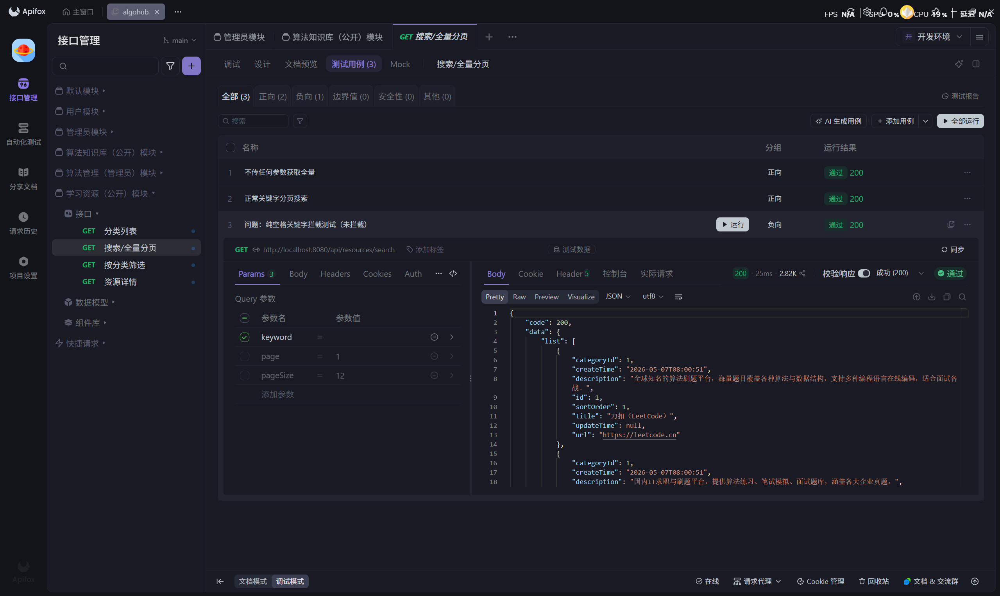
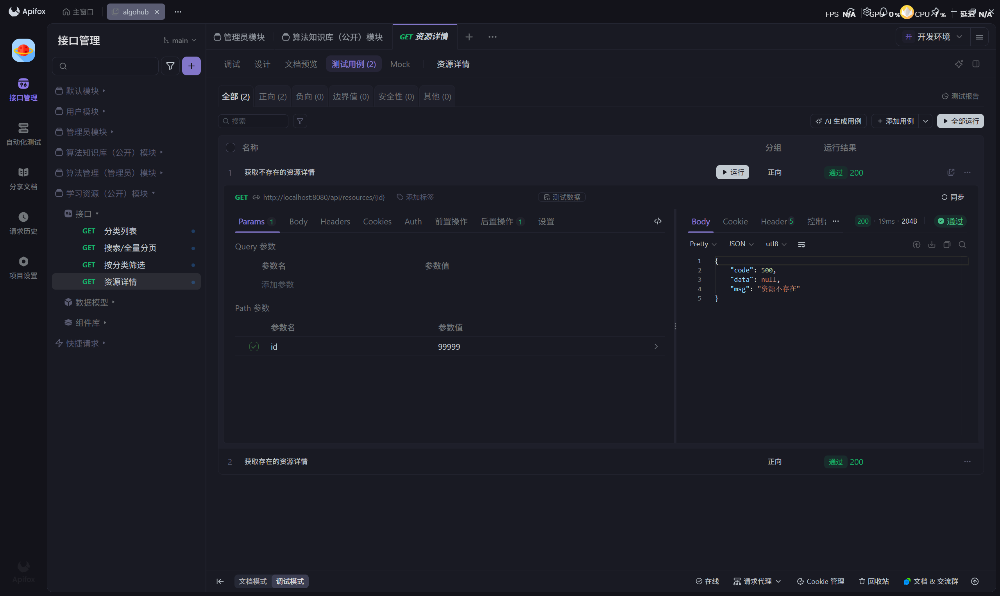
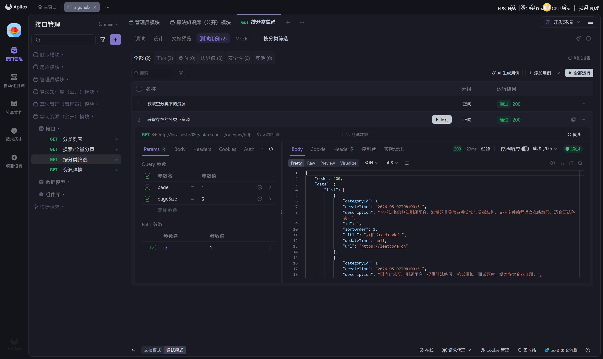

# 学习资源（公开）模块接口测试记录

**测试执行人：** 尹冰洁
**测试时间：** 2026-05-07
**测试范围：** 学习资源公开模块的 4 个接口功能测试

## 一、 功能接口测试执行清单

### 1. 资源分类列表功能
| 编号 | 接口路径及方法 | 测试场景描述 | 模拟输入 | 预期结果 (据代码设计) | 实际结果 | 状态 |
|---|---|---|---|---|---|---|
| TC-R01 | `GET /api/resources/categories` | 正常获取资源分类列表 | 无 | 返回 code: 200，包含分类数据的列表 | 返回完整分类树 | ✅ 通过 |

### 2. 搜索及全量资源功能
| 编号 | 接口路径及方法 | 测试场景描述 | 模拟输入 (Query 参数) | 预期结果 | 实际结果 | 状态 |
|---|---|---|---|---|---|---|
| TC-R02 | `GET /api/resources/search` | 正常关键字分页搜索 | `keyword=教程`, `page=1`, `pageSize=12` | 返回分页数据 PageResult | 数据及分页信息正确 | ✅ 通过 |
| TC-R03 | `GET /api/resources/search` | 不传任何参数获取全量 | 无参数 | 触发后端默认值 page=1, pageSize=12 | 默认分页生效 | ✅ 通过 |
| TC-R04 | `GET /api/resources/search` | **纯空格关键字拦截测试** | `keyword=   ` (敲入3个纯空格) | 触发后端校验，返回错误："搜索关键字不能为空" | **未拦截，返回了 code: 200 及全量数据** | ❌ **未通过 (发现Bug)** |

### 3. 按分类筛选功能
| 编号 | 接口路径及方法 | 测试场景描述 | 模拟输入 (Path + Query) | 预期结果 | 实际结果 | 状态 |
|---|---|---|---|---|---|---|
| TC-R05 | `GET /api/resources/category/{id}` | 获取存在的分类下资源 | Path: `id=1` Query: `page=1, pageSize=5` | 返回该分类下的分页资源列表 | 分页数据返回正常 | ✅ 通过 |
| TC-R06 | `GET /api/resources/category/{id}` | 获取空分类下的资源 | Path: `id=99` (无资源的分类) | 返回 code: 200，记录列表为空 [] | 返回空列表 | ✅ 通过 |

### 4. 获取资源详情功能
| 编号 | 接口路径及方法 | 测试场景描述 | 模拟输入 (Path) | 预期结果 | 实际结果 | 状态 |
|---|---|---|---|---|---|---|
| TC-R07 | `GET /api/resources/{id}` | 获取存在的资源详情 | Path: `id=1` | 返回 code: 200，包含 URL 等详情字段 | 数据返回正常 | ✅ 通过 |
| TC-R08 | `GET /api/resources/{id}` | **获取不存在的资源详情** | Path: `id=99999` | 触发判空逻辑，返回错误："资源不存在" | 提示"资源不存在" | ✅ 通过 |

## 二、测试结果图片（展示部分）

**1. 学习资源推荐-公开模块测试结果：**

**2. 搜索接口纯空格校验拦截：（未拦截，有Bug，需要修改）**

**3. 不存在的资源详情拦截：**

**4. 正常分类与数据查询：**
