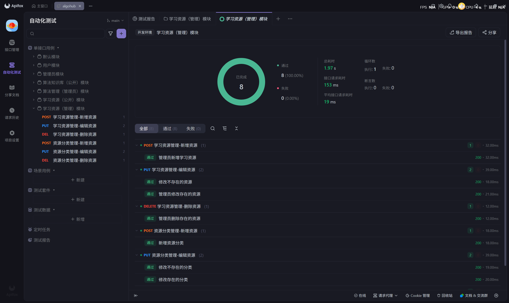
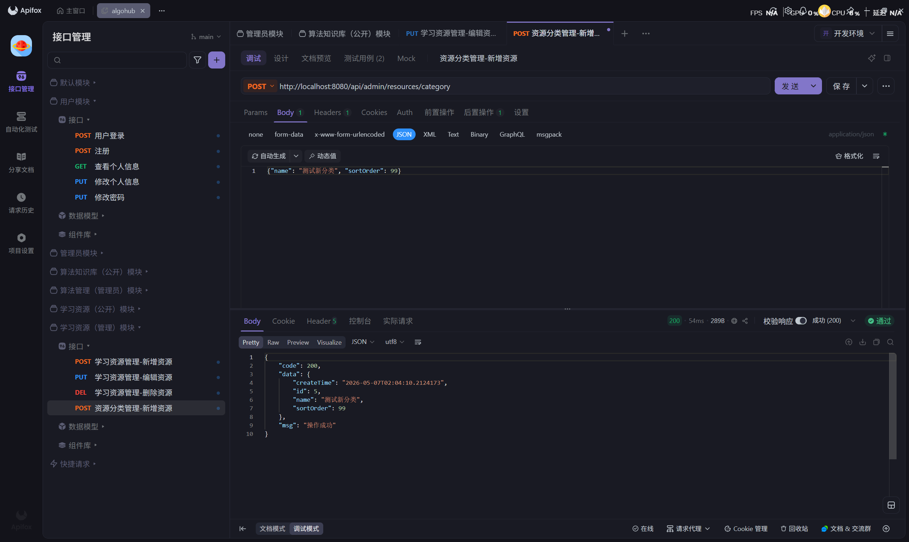
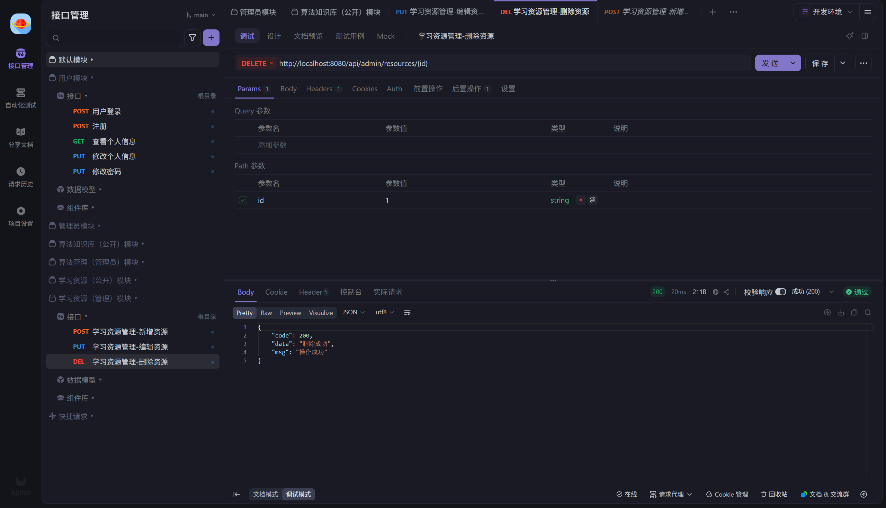

# 学习资源（管理员）模块接口测试记录

**测试执行人：** 尹冰洁
**测试时间：** 2026-05-07
**测试范围：** 学习资源后台管理接口（资源增删改、分类增删改）

## 一、 接口功能测试执行清单

### 1. 学习资源管理 (CRUD)
| 编号 | 接口路径及方法 | 测试场景描述 | 模拟输入 (参数/Path/Body) | 预期结果 | 实际结果 | 状态 |
|---|---|---|---|---|---|---|
| TC-RM05 | `POST /api/admin/resources` | 管理员新增学习资源 | Body 包含 title, url, categoryId 等 | 返回 code: 200 及新增的资源对象 | 新增成功 | ✅ 通过 |
| TC-RM06 | `PUT /api/admin/resources/{id}` | 管理员修改存在的资源 | Path: `id = 1` Body: 需修改的字段 | 返回 code: 200，字段成功更新 | 修改成功 | ✅ 通过 |
| TC-RM07 | `PUT /api/admin/resources/{id}` | **修改不存在的资源** | Path: `id = 999` | 返回 "资源不存在" | 拦截并提示 | ✅ 通过 |
| TC-RM08 | `DELETE /api/admin/resources/{id}`| 管理员删除存在的资源 | Path: `id = 1` | 返回 code: 200，"删除成功" | 删除成功 | ✅ 通过 |

### 2. 资源分类管理 (CRUD)
| 编号 | 接口路径及方法 | 测试场景描述 | 模拟输入 (参数/Path/Body) | 预期结果 | 实际结果 | 状态 |
|---|---|---|---|---|---|---|
| TC-RM09 | `POST /api/admin/resources/category` | 新增资源分类 | Body: `{"name": "测试新分类", "sortOrder": 99}` | 返回 code: 200，并自动生成 createTime | 新增成功 | ✅ 通过 |
| TC-RM10 | `PUT /api/admin/resources/category/{id}` | 修改存在的分类 | Path: `id = 5` Body: `{name:"被修改的测试分类"}` | 返回 code: 200，更新对应的分类字段 | 更新成功 | ✅ 通过 |
| TC-RM11 | `PUT /api/admin/resources/category/{id}` | **修改不存在的分类** | Path: `id = 999` | 触发判空异常处理，返回 "分类不存在" | 拦截并提示 | ✅ 通过 |
| TC-RM12 | `DELETE /api/admin/resources/category/{id}`| 删除存在的分类 | Path: `id = 5` | 返回 code: 200，"删除成功" | 删除成功 | ✅ 通过 |

## 二、测试结果图片（展示部分）

**1. 学习资源推荐-管理模块测试结果：**

**2. 资源新增与删除测试成功：**

