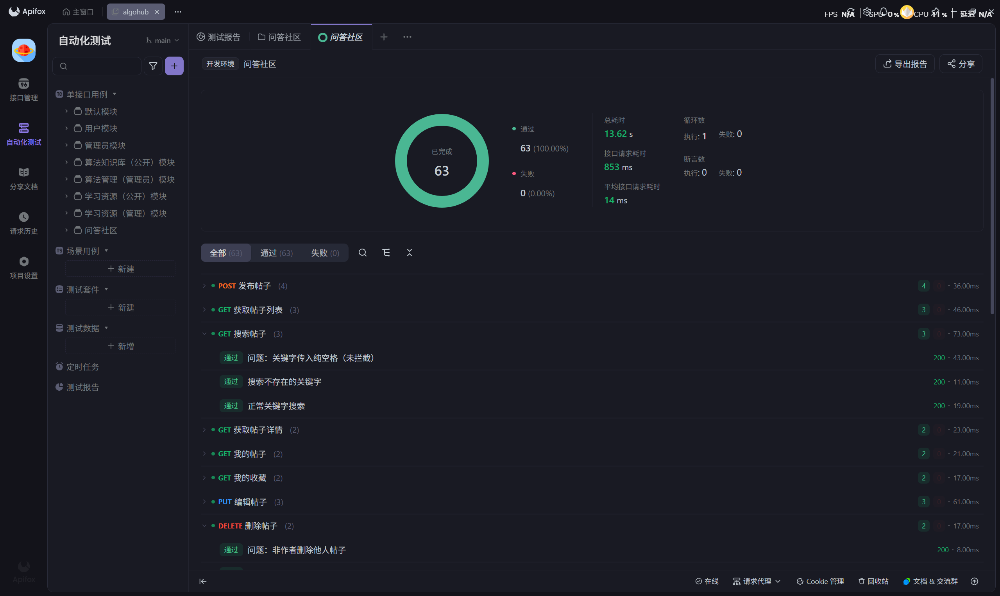
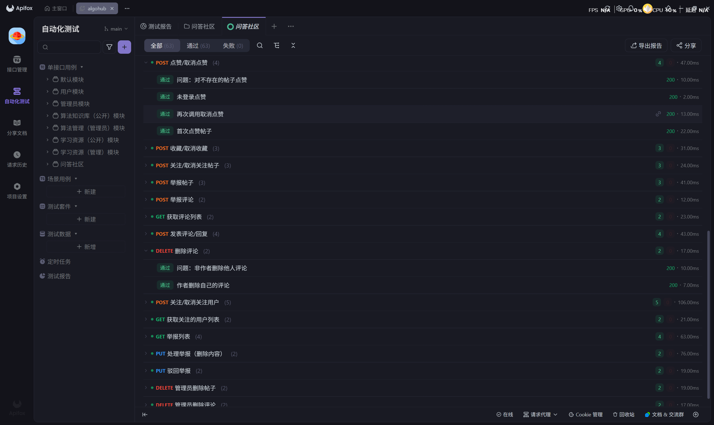

# 问答社区模块接口测试记录

**测试执行人：** 尹冰洁
**测试时间：** 2026-05-09
**测试范围：** 问答社区模块共 22 个接口，覆盖帖子 CRUD、搜索、点赞/收藏/关注、评论/回复、举报、用户关注、管理员审核等完整流程。

## 一、 社区模块接口功能测试执行清单

### 1. 发布帖子功能
| 编号 | 接口路径及方法 | 测试场景描述 | 模拟输入 (Body / Header) | 预期结果 (据代码设计) | 实际结果 | 状态 |
|---|---|---|---|---|---|---|
| TC-C01 | `POST /api/posts` | 学生正常发布帖子 | Body: `{"title": "测试帖子标题", "content": "这是测试内容"}`   Header: 携带学生 Token | 返回 code: 200，data 为新创建的帖子对象 | code: 200，成功创建 | ✅ 通过 |
| TC-C02 | `POST /api/posts` | 标题为空发布帖子 | Body: `{"title": "", "content": "内容"}`   Header: 携带 Token | 返回 code: 500，msg: "帖子标题不能为空" | code: 500，拦截正常 | ✅ 通过 |
| TC-C03 | `POST /api/posts` | 标题传入纯空格 | Body: `{"title": "   ", "content": "test"}`   Header: 携带 Token | 返回 code: 500，msg: "帖子标题不能为空" | code: 500，拦截正常 | ✅ 通过 |
| TC-C04 | `POST /api/posts` | 未登录发布帖子 | Body: `{"title": "test", "content": "test"}`   Header: 不带 Token | 返回 code: 401，msg: "请先登录" | code: 401，拦截正常 | ✅ 通过 |

### 2. 帖子列表功能
| 编号 | 接口路径及方法 | 测试场景描述 | 模拟输入 (Query 参数) | 预期结果 (据代码设计) | 实际结果 | 状态 |
|---|---|---|---|---|---|---|
| TC-C05 | `GET /api/posts` | 默认分页获取帖子列表 | 无参数 | 返回 code: 200，data 为分页列表，默认 page=1, pageSize=10, sort=time | code: 200，分页数据正常 | ✅ 通过 |
| TC-C06 | `GET /api/posts` | 指定分页参数 | `page=1`, `pageSize=5` | 返回对应分页数据，pageSize 生效 | code: 200，pageSize 生效 | ✅ 通过 |
| TC-C07 | `GET /api/posts` | sort=hot 按热度排序 | `sort=hot` | 返回按热度排序的帖子列表 | code: 200，排序正常 | ✅ 通过 |

### 3. 搜索帖子功能
| 编号 | 接口路径及方法 | 测试场景描述 | 模拟输入 (Query 参数) | 预期结果 (据代码设计) | 实际结果 | 状态 |
|---|---|---|---|---|---|---|
| TC-C08 | `GET /api/posts/search` | 正常关键字搜索 | `keyword=测试` | 返回匹配帖子的分页列表 | code: 200，数据匹配 | ✅ 通过 |
| TC-C09 | `GET /api/posts/search` | 搜索不存在的关键字 | `keyword=11111` | 返回 code: 200，records 为空列表 | code: 200，列表为空 | ✅ 通过 |
| TC-C10 | `GET /api/posts/search` | 关键字传入纯空格 | `keyword=   `（纯空格） | 预期拦截并提示"搜索关键字不能为空" | code: 200，未拦截，直接返回全表数据 | ❌ 未通过（发现Bug） |

### 4. 帖子详情功能
| 编号 | 接口路径及方法 | 测试场景描述 | 模拟输入 (Path) | 预期结果 (据代码设计) | 实际结果 | 状态 |
|---|---|---|---|---|---|---|
| TC-C11 | `GET /api/posts/{id}` | 查询存在的帖子详情 | Path: `id=3` | 返回 code: 200，包含帖子详细字段（title, content, user信息, likeCount, commentCount 等） | code: 200，数据完整 | ✅ 通过 |
| TC-C12 | `GET /api/posts/{id}` | 查询不存在的帖子 | Path: `id=99999` | 返回 code: 500，msg: "帖子不存在" | code: 500，提示正常 | ✅ 通过 |

### 5. 点赞帖子功能
| 编号 | 接口路径及方法 | 测试场景描述 | 模拟输入 (Path / Header) | 预期结果 (据代码设计) | 实际结果 | 状态 |
|---|---|---|---|---|---|---|
| TC-C13 | `POST /api/posts/{id}/like` | 首次点赞帖子 | Path: `id=3`   Header: 携带 Token | 返回 code: 200，msg: "已点赞" | code: 200，已点赞 | ✅ 通过 |
| TC-C14 | `POST /api/posts/{id}/like` | 再次调用取消点赞 | Path: `id=3` | 返回 code: 200，msg: "已取消点赞" | code: 200，已取消点赞 | ✅ 通过 |
| TC-C15 | `POST /api/posts/{id}/like` | 对不存在的帖子点赞 | Path: `id=99999` | 预期返回错误提示"帖子不存在" | code: 200，msg: "操作成功"，data: "已取消点赞" | ❌ 未通过（发现Bug） |
| TC-C16 | `POST /api/posts/{id}/like` | 未登录点赞 | Header: 不带 Token | 返回 code: 401，msg: "请先登录" | code: 401，拦截正常 | ✅ 通过 |

### 6. 收藏帖子功能
| 编号 | 接口路径及方法 | 测试场景描述 | 模拟输入 (Path / Header) | 预期结果 (据代码设计) | 实际结果 | 状态 |
|---|---|---|---|---|---|---|
| TC-C17 | `POST /api/posts/{id}/favorite` | 收藏帖子 | Path: `id=3`   Header: 携带 Token | 返回 code: 200，msg: "已收藏" | code: 200，已收藏 | ✅ 通过 |
| TC-C18 | `POST /api/posts/{id}/favorite` | 再次调用取消收藏 | Path: `id=3` | 返回 code: 200，msg: "已取消收藏" | code: 200，已取消收藏 | ✅ 通过 |
| TC-C19 | `POST /api/posts/{id}/favorite` | 未登录收藏 | Header: 不带 Token | 返回 code: 401，msg: "请先登录" | code: 401，拦截正常 | ✅ 通过 |

### 7. 关注帖子功能
| 编号 | 接口路径及方法 | 测试场景描述 | 模拟输入 (Path / Header) | 预期结果 (据代码设计) | 实际结果 | 状态 |
|---|---|---|---|---|---|---|
| TC-C20 | `POST /api/posts/{id}/follow` | 关注帖子 | Path: `id=3`   Header: 携带 Token | 返回 code: 200，msg: "已关注" | code: 200，已关注 | ✅ 通过 |
| TC-C21 | `POST /api/posts/{id}/follow` | 再次调用取消关注 | Path: `id=3` | 返回 code: 200，msg: "已取消关注" | code: 200，已取消关注 | ✅ 通过 |
| TC-C22 | `POST /api/posts/{id}/follow` | 未登录关注 | Header: 不带 Token | 返回 code: 401，msg: "请先登录" | code: 401，拦截正常 | ✅ 通过 |

### 8. 我的帖子功能
| 编号 | 接口路径及方法 | 测试场景描述 | 模拟输入 (Query / Header) | 预期结果 (据代码设计) | 实际结果 | 状态 |
|---|---|---|---|---|---|---|
| TC-C23 | `GET /api/posts/my` | 登录用户查看自己的帖子 | Header: 携带 Token   Query: `page=1`, `pageSize=10` | 返回 code: 200，仅包含当前用户的帖子 | code: 200，数据正常 | ✅ 通过 |
| TC-C24 | `GET /api/posts/my` | 未登录访问我的帖子 | Header: 不带 Token | 返回 code: 401，msg: "请先登录" | code: 401，拦截正常 | ✅ 通过 |

### 9. 我的收藏功能
| 编号 | 接口路径及方法 | 测试场景描述 | 模拟输入 (Query / Header) | 预期结果 (据代码设计) | 实际结果 | 状态 |
|---|---|---|---|---|---|---|
| TC-C25 | `GET /api/posts/favorites` | 登录用户查看收藏帖子 | Header: 携带 Token | 返回 code: 200，仅包含已收藏的帖子 | code: 200，数据正常 | ✅ 通过 |
| TC-C26 | `GET /api/posts/favorites` | 未登录访问收藏列表 | Header: 不带 Token | 返回 code: 401，msg: "请先登录" | code: 401，拦截正常 | ✅ 通过 |

### 10. 发表评论功能
| 编号 | 接口路径及方法 | 测试场景描述 | 模拟输入 (Body / Header) | 预期结果 (据代码设计) | 实际结果 | 状态 |
|---|---|---|---|---|---|---|
| TC-C27 | `POST /api/posts/{id}/comments` | 发表评论 | Path: `id=3`   Body: `{"content": "这是一条评论"}` | 返回 code: 200，data 为新评论对象（parentId 为空） | code: 200，评论成功 | ✅ 通过 |
| TC-C28 | `POST /api/posts/{id}/comments` | 回复某条评论（嵌套） | Path: `id=3`   Body: `{"content": "回复评论", "parentId": 1}` | 返回 code: 200，data 中 parentId 为对应评论 ID | code: 200，回复成功 | ✅ 通过 |
| TC-C29 | `POST /api/posts/{id}/comments` | 评论内容为空 | Body: `{"content": ""}` | 返回 code: 500，msg: "评论内容不能为空" | code: 500，拦截正常 | ✅ 通过 |
| TC-C30 | `POST /api/posts/{id}/comments` | 未登录评论 | Header: 不带 Token | 返回 code: 401，msg: "请先登录" | code: 401，拦截正常 | ✅ 通过 |

### 11. 评论列表功能
| 编号 | 接口路径及方法 | 测试场景描述 | 模拟输入 (Path / Query) | 预期结果 (据代码设计) | 实际结果 | 状态 |
|---|---|---|---|---|---|---|
| TC-C31 | `GET /api/posts/{id}/comments` | 获取帖子评论列表 | Path: `id=3`   Query: `page=1`, `pageSize=20` | 返回 code: 200，分页评论数据，含嵌套回复（parent_id） | code: 200，数据正常 | ✅ 通过 |
| TC-C32 | `GET /api/posts/{id}/comments` | 获取无评论帖子的评论列表 | Path: `id=4` | 返回 code: 200，records 为空列表 | code: 200，列表为空 | ✅ 通过 |

### 12. 举报帖子功能
| 编号 | 接口路径及方法 | 测试场景描述 | 模拟输入 (Body / Header) | 预期结果 (据代码设计) | 实际结果 | 状态 |
|---|---|---|---|---|---|---|
| TC-C33 | `POST /api/posts/{id}/report` | 正常举报帖子 | Path: `id=5`   Body: `{"reason": "内容违规"}` | 返回 code: 200，msg: "举报已提交" | code: 200，举报成功 | ✅ 通过 |
| TC-C34 | `POST /api/posts/{id}/report` | 举报不填原因 | Path: `id=5`   Body: `{}` | 返回 code: 200，举报仍可提交（reason 为空） | code: 200，提交成功 | ✅ 通过 |
| TC-C35 | `POST /api/posts/{id}/report` | 未登录举报 | Header: 不带 Token | 返回 code: 401，msg: "请先登录" | code: 401，拦截正常 | ✅ 通过 |

### 13. 举报评论功能
| 编号 | 接口路径及方法 | 测试场景描述 | 模拟输入 (Body / Header) | 预期结果 (据代码设计) | 实际结果 | 状态 |
|---|---|---|---|---|---|---|
| TC-C36 | `POST /api/comments/{id}/report` | 正常举报评论 | Path: `id=存在的评论ID`   Body: `{"reason": "不当言论"}` | 返回 code: 200，msg: "举报已提交" | code: 200，举报成功 | ✅ 通过 |
| TC-C37 | `POST /api/comments/{id}/report` | 未登录举报评论 | Header: 不带 Token | 返回 code: 401，msg: "请先登录" | code: 401，拦截正常 | ✅ 通过 |

### 14. 编辑帖子功能
| 编号 | 接口路径及方法 | 测试场景描述 | 模拟输入 (Body / Header) | 预期结果 (据代码设计) | 实际结果 | 状态 |
|---|---|---|---|---|---|---|
| TC-C38 | `PUT /api/posts/{id}` | 作者正常编辑帖子 | Path: `id=4`   Body: `{"title": "修改后的标题", "content": "修改后的内容"}` | 返回 code: 200，data 为更新后的帖子 | code: 200，修改成功 | ✅ 通过 |
| TC-C39 | `PUT /api/posts/{id}` | 非作者编辑他人帖子 | Path: `id=3`   Header: 携带另一个用户 Token | 返回 code: 500，msg: "帖子不存在或无权编辑" | code: 500，拦截正常 | ✅ 通过 |
| TC-C40 | `PUT /api/posts/{id}` | 编辑不存在的帖子 | Path: `id=99999`   Body: `{"title": "test"}` | 返回 code: 500，msg: "帖子不存在或无权编辑" | code: 500，拦截正常 | ✅ 通过 |

### 15. 删除评论功能
| 编号 | 接口路径及方法 | 测试场景描述 | 模拟输入 (Path / Header) | 预期结果 (据代码设计) | 实际结果 | 状态 |
|---|---|---|---|---|---|---|
| TC-C41 | `DELETE /api/comments/{id}` | 作者删除自己的评论 | Path: `id=刚创建的评论ID`   Header: 携带作者 Token | 返回 code: 200，msg: "删除成功" | code: 200，删除成功 | ✅ 通过 |
| TC-C42 | `DELETE /api/comments/{id}` | 非作者删除他人评论 | Path: `id=他人评论ID`   Header: 携带另一个用户 Token | 预期返回错误提示"无权删除" | code: 200，msg: "删除成功"（实际未删除） | ❌ 未通过（发现Bug） |

### 16. 删除帖子功能
| 编号 | 接口路径及方法 | 测试场景描述 | 模拟输入 (Path / Header) | 预期结果 (据代码设计) | 实际结果 | 状态 |
|---|---|---|---|---|---|---|
| TC-C43 | `DELETE /api/posts/{id}` | 作者删除自己的帖子 | Path: `id=自己的帖子ID`   Header: 携带作者 Token | 返回 code: 200，msg: "删除成功" | code: 200，删除成功 | ✅ 通过 |
| TC-C44 | `DELETE /api/posts/{id}` | 非作者删除他人帖子 | Path: `id=其他用户的帖子ID`   Header: 携带另一个用户 Token | 预期返回错误提示"无权删除" | code: 200，msg: "删除成功" | ❌ 未通过（发现Bug） |

### 17. 关注用户功能
| 编号 | 接口路径及方法 | 测试场景描述 | 模拟输入 (Path / Header) | 预期结果 (据代码设计) | 实际结果 | 状态 |
|---|---|---|---|---|---|---|
| TC-C45 | `POST /api/users/{id}/follow` | 关注其他用户 | Path: `id=其他用户ID`   Header: 携带 Token | 返回 code: 200，msg: "已关注" | code: 200，已关注 | ✅ 通过 |
| TC-C46 | `POST /api/users/{id}/follow` | 再次调用取消关注 | Path: `id=同一用户ID` | 返回 code: 200，msg: "已取消关注" | code: 200，已取消关注 | ✅ 通过 |
| TC-C47 | `POST /api/users/{id}/follow` | 关注不存在的用户 | Path: `id=99999` | 预期返回错误提示 | code: 500，内部错误 | ✅ 通过（拦截正常） |
| TC-C48 | `POST /api/users/{id}/follow` | 关注自己 | Path: `id=自己的用户ID` | 预期拦截"不能关注自己" | code: 200，msg: "操作成功"，data: "已取消关注" | ❌ 未通过（发现Bug） |
| TC-C49 | `POST /api/users/{id}/follow` | 未登录关注用户 | Header: 不带 Token | 返回 code: 401，msg: "请先登录" | code: 401，拦截正常 | ✅ 通过 |

### 18. 查看关注用户列表功能
| 编号 | 接口路径及方法 | 测试场景描述 | 模拟输入 (Query / Header) | 预期结果 (据代码设计) | 实际结果 | 状态 |
|---|---|---|---|---|---|---|
| TC-C50 | `GET /api/users/following` | 查看已关注用户列表 | Header: 携带 Token | 返回 code: 200，分页用户列表 | code: 200，数据正常 | ✅ 通过 |
| TC-C51 | `GET /api/users/following` | 未登录访问关注列表 | Header: 不带 Token | 返回 code: 401，msg: "请先登录" | code: 401，拦截正常 | ✅ 通过 |

### 19. 管理员查看举报列表功能
| 编号 | 接口路径及方法 | 测试场景描述 | 模拟输入 (Query / Header) | 预期结果 (据代码设计) | 实际结果 | 状态 |
|---|---|---|---|---|---|---|
| TC-C52 | `GET /api/admin/reports` | 管理员查看全部举报 | Header: 携带管理员 Token | 返回 code: 200，分页举报列表 | code: 200，数据正常 | ✅ 通过 |
| TC-C53 | `GET /api/admin/reports` | 按状态筛选举报 | Header: 携带管理员 Token   Query: `status=PENDING` | 返回 code: 200，仅含 PENDING 状态的举报 | code: 200，筛选正常 | ✅ 通过 |
| TC-C54 | `GET /api/admin/reports` | 学生访问举报列表 | Header: 携带学生 Token | 返回 code: 403，msg: "无权限，仅管理员及以上可操作" | code: 403，拦截正常 | ✅ 通过 |
| TC-C55 | `GET /api/admin/reports` | 未登录访问举报列表 | Header: 不带 Token | 返回 code: 401/403（拦截器拦截） | code: 401，拦截正常 | ✅ 通过 |

### 20. 管理员处理举报功能
| 编号 | 接口路径及方法 | 测试场景描述 | 模拟输入 (Path / Header) | 预期结果 (据代码设计) | 实际结果 | 状态 |
|---|---|---|---|---|---|---|
| TC-C56 | `PUT /api/admin/reports/{id}/resolve` | 管理员处理举报（删除对应内容） | Path: `id=存在的举报ID`   Header: 携带管理员 Token | 返回 code: 200，msg: "举报已处理，内容已删除" | code: 200，处理成功 | ✅ 通过 |
| TC-C57 | `PUT /api/admin/reports/{id}/resolve` | 学生尝试处理举报 | Header: 携带学生 Token | 返回 code: 403，msg: "无权限，仅管理员及以上可操作" | code: 403，拦截正常 | ✅ 通过 |

### 21. 管理员驳回举报功能
| 编号 | 接口路径及方法 | 测试场景描述 | 模拟输入 (Path / Header) | 预期结果 (据代码设计) | 实际结果 | 状态 |
|---|---|---|---|---|---|---|
| TC-C58 | `PUT /api/admin/reports/{id}/dismiss` | 管理员驳回举报 | Path: `id=存在的举报ID`   Header: 携带管理员 Token | 返回 code: 200，msg: "举报已驳回" | code: 200，驳回成功 | ✅ 通过 |
| TC-C59 | `PUT /api/admin/reports/{id}/dismiss` | 学生尝试驳回举报 | Header: 携带学生 Token | 返回 code: 403，msg: "无权限，仅管理员及以上可操作" | code: 403，拦截正常 | ✅ 通过 |

### 22. 管理员删除帖子功能
| 编号 | 接口路径及方法 | 测试场景描述 | 模拟输入 (Path / Header) | 预期结果 (据代码设计) | 实际结果 | 状态 |
|---|---|---|---|---|---|---|
| TC-C60 | `DELETE /api/admin/posts/{id}` | 管理员删除任意帖子 | Path: `id=任意帖子ID`   Header: 携带管理员 Token | 返回 code: 200，msg: "帖子已删除" | code: 200，删除成功 | ✅ 通过 |
| TC-C61 | `DELETE /api/admin/posts/{id}` | 学生尝试删除他人帖子 | Header: 携带学生 Token | 返回 code: 403，msg: "无权限，仅管理员及以上可操作" | code: 403，拦截正常 | ✅ 通过 |

### 23. 管理员删除评论功能
| 编号 | 接口路径及方法 | 测试场景描述 | 模拟输入 (Path / Header) | 预期结果 (据代码设计) | 实际结果 | 状态 |
|---|---|---|---|---|---|---|
| TC-C62 | `DELETE /api/admin/comments/{id}` | 管理员删除任意评论 | Path: `id=任意评论ID`   Header: 携带管理员 Token | 返回 code: 200，msg: "评论已删除" | code: 200，删除成功 | ✅ 通过 |
| TC-C63 | `DELETE /api/admin/comments/{id}` | 学生尝试删除他人评论 | Header: 携带学生 Token | 返回 code: 403，msg: "无权限，仅管理员及以上可操作" | code: 403，拦截正常 | ✅ 通过 |

## 二、测试结果图片

