# 修复验证记录

**编写人：** 尹冰洁
**验证日期：** 2026-05-10
**对应文档：** [Bug清单.md](./Bug清单.md)

---

## 一、功能缺陷修复验证

### Bug-1：修改密码——新旧密码一致仍可修改成功

| 项目 | 内容 |
|---|---|
| 所属模块 | 用户模块 - 修改密码 |
| 修复前 | 旧密码与新密码相同，返回 `code:200`，修改成功（见 [1.测试记录](./1.测试记录：用户体系-用户模块.md) TC-U17） |
| 修复后 | 同一请求，返回 `code:500`，"新密码不能与旧密码相同" |
| 修复后截图 | 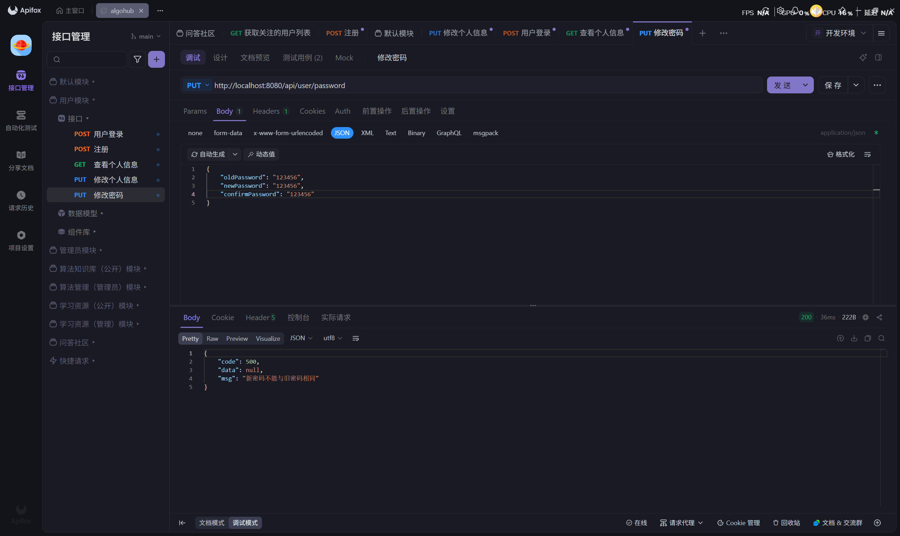 |
| 验证结论 | ✅ 已修复 |

---

### Bug-2：修改个人信息——信息未变化仍提示修改成功

| 项目 | 内容 |
|---|---|
| 所属模块 | 用户模块 - 修改个人信息 |
| 修复前 | 昵称、手机号等与数据库一致，提交后返回 `code:200`，"操作成功"（见 [1.测试记录](./1.测试记录：用户体系-用户模块.md) 修改个人信息部分） |
| 修复后 | 数据无变化时，返回 `code:500`，"信息未发生修改" |
| 修复后截图 | 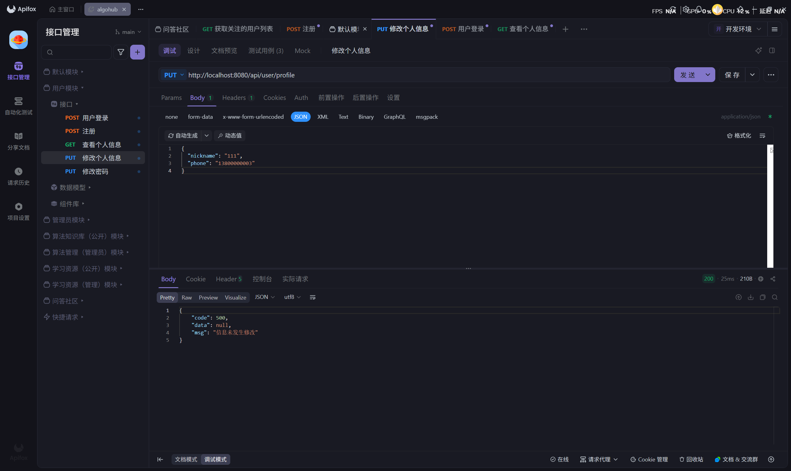 |
| 验证结论 | ✅ 已修复 |

---

### Bug-3：用户注册——昵称（nickname）为空可注册成功

| 项目 | 内容 |
|---|---|
| 所属模块 | 用户模块 - 注册 |
| 修复前 | nickname 传入空字符串，注册成功（见 [1.测试记录](./1.测试记录：用户体系-用户模块.md) 注册部分） |
| 修复后 | nickname 为空时，返回 `code:500`，"昵称不能为空" |
| 修复后截图 | 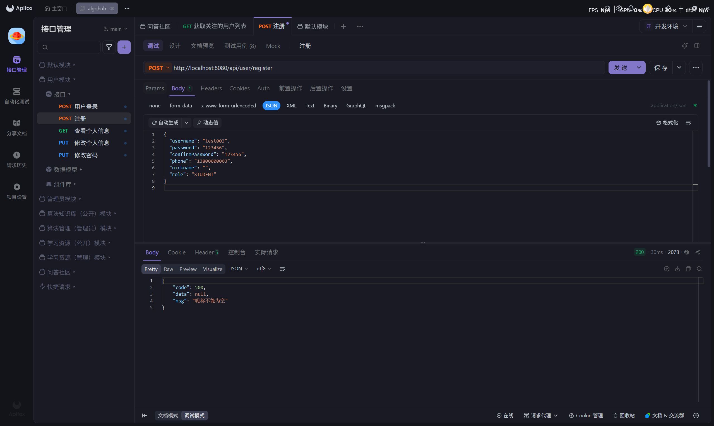 |
| 验证结论 | ✅ 已修复 |

---

### Bug-4：管理员操作——允许禁用自身账号

| 项目 | 内容 |
|---|---|
| 所属模块 | 管理员模块 - 禁用/启用账号 |
| 修复前 | 管理员 Token + 自身 ID，禁用成功，"账号已禁用"，管理员无法再次登录（见 [2.测试记录](./2.测试记录：用户体系-管理员模块.md) TC-A04） |
| 修复后 | 同一请求，返回 `code:500`，"无权操作：不可禁用同级或更高级别的用户" |
| 修复后截图 | 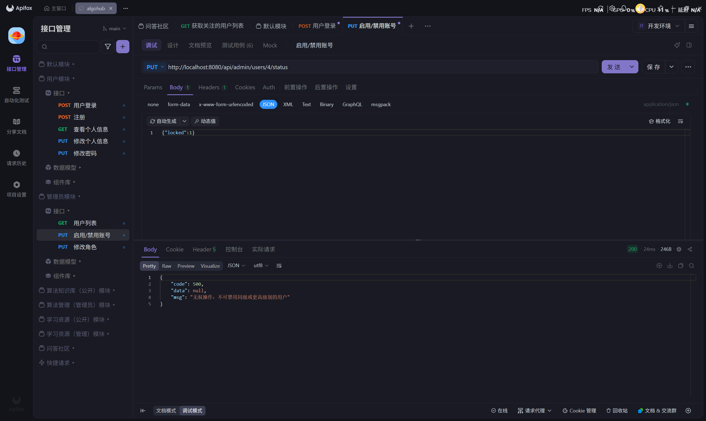 |
| 验证结论 | ✅ 已修复 |

---

### Bug-5：管理员操作——允许降低自身权限

| 项目 | 内容 |
|---|---|
| 所属模块 | 管理员模块 - 修改角色 |
| 修复前 | 管理员操作自己账号，角色改为 STUDENT，操作成功，管理员丧失管理权限（见 [2.测试记录](./2.测试记录：用户体系-管理员模块.md) TC-A10） |
| 修复后 | 同一请求，返回 `code:500`，"无权限：仅群主可修改他人角色" |
| 修复后截图 | 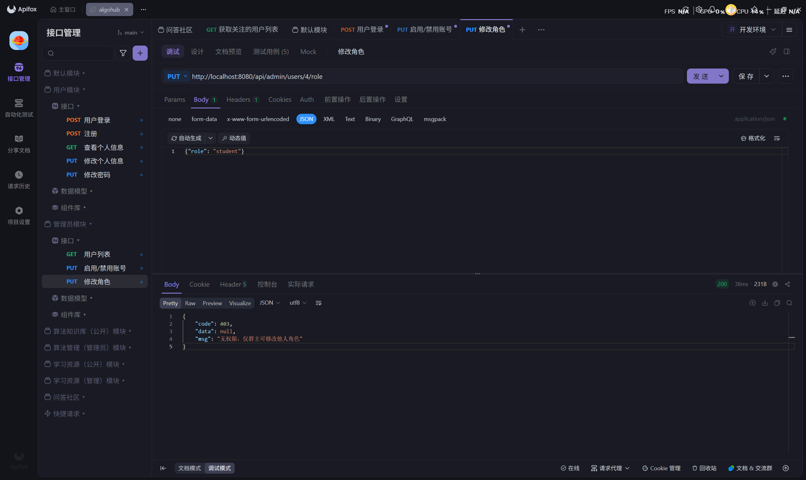 |
| 验证结论 | ✅ 已修复 |

---

### Bug-6：算法搜索——keyword 传入纯空格未被拦截

| 项目 | 内容 |
|---|---|
| 所属模块 | 算法知识库 - 搜索算法 |
| 修复前 | keyword=纯空格，未拦截，触发全表模糊查询，返回所有算法数据（见 [3.测试记录](./3.测试记录：算法知识库-算法知识库(公开)模块.md)） |
| 修复后 | keyword=纯空格，返回 `code:500`，"搜索关键字不能为空" |
| 修复后截图 | 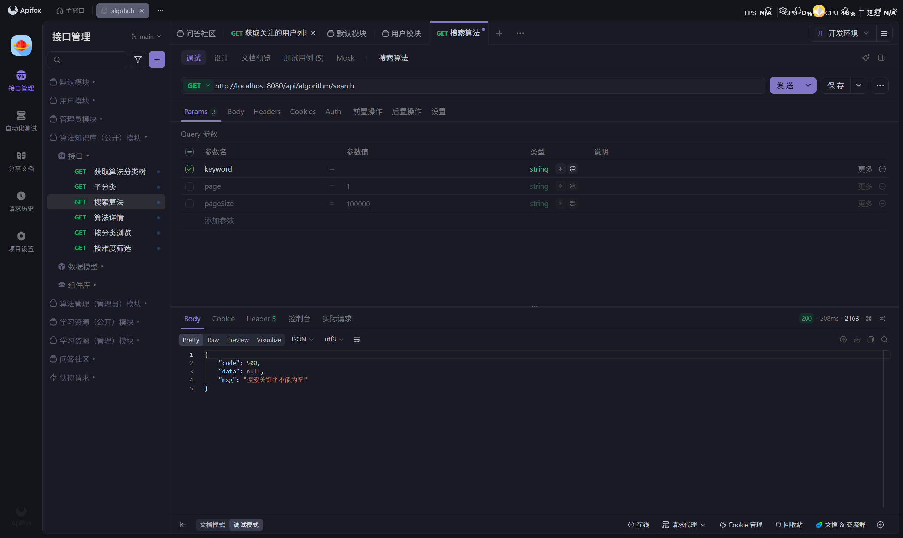 |
| 验证结论 | ✅ 已修复 |

---

### Bug-7：学习资源搜索——纯空格查全量

| 项目 | 内容 |
|---|---|
| 所属模块 | 学习资源（公开）模块 - 搜索资源 |
| 修复前 | keyword=连续空格，`trim().isEmpty() && !keyword.isEmpty()` 拦截失效，返回全量资源数据（见 [5.测试记录](./5.测试记录：学习资源推荐-公开模块.md)） |
| 修复后 | keyword=纯空格，返回 `code:500`，"搜索关键字不能为空" |
| 修复后截图 | 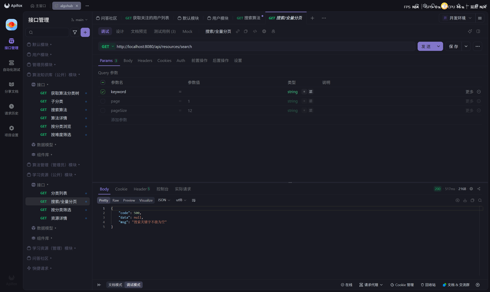 |
| 验证结论 | ✅ 已修复 |

---

### Bug-8：帖子搜索——keyword 传入纯空格未被拦截

| 项目 | 内容 |
|---|---|
| 所属模块 | 问答社区 - 搜索帖子 |
| 修复前 | keyword=纯空格，未拦截，返回全表帖子数据（见 [7.测试记录](./7.测试记录：问答社区-社区功能模块.md) TC-C10） |
| 修复后 | keyword=纯空格，返回 `code:500`，"搜索关键字不能为空" |
| 修复后截图 | 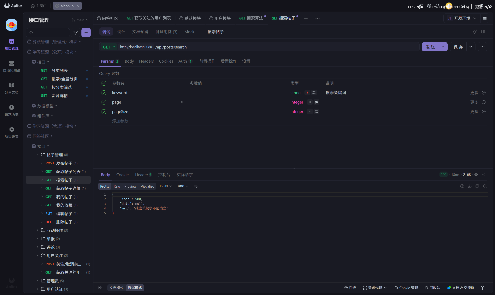 |
| 验证结论 | ✅ 已修复 |

---

### Bug-9：点赞/收藏/关注——toggle 操作未校验目标是否存在及合法性

#### 9a. 对不存在的帖子点赞

| 项目 | 内容 |
|---|---|
| 所属模块 | 问答社区 - 点赞帖子 |
| 修复前 | id=99999 点赞，返回 `code:200`，"已取消点赞"（见 [7.测试记录](./7.测试记录：问答社区-社区功能模块.md) TC-C15） |
| 修复后 | id=99999 点赞，返回 `code:500`，"帖子不存在" |
| 修复后截图 | 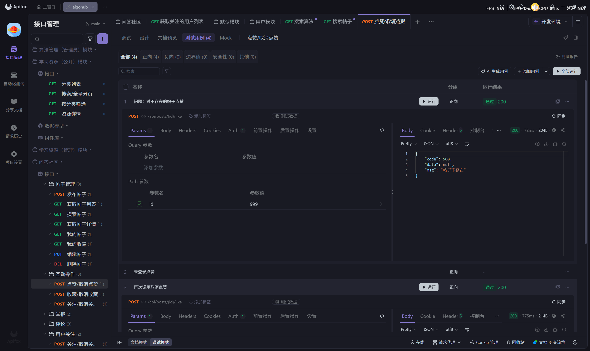 |
| 验证结论 | ✅ 已修复 |

#### 9b. 用户关注自己

| 项目 | 内容 |
|---|---|
| 所属模块 | 问答社区 - 关注用户 |
| 修复前 | 关注自己的用户 ID，返回 `code:200`，"已取消关注"（见 [7.测试记录](./7.测试记录：问答社区-社区功能模块.md) TC-C48） |
| 修复后 | 关注自己，返回 `code:500`，"不能关注自己" |
| 修复后截图 | 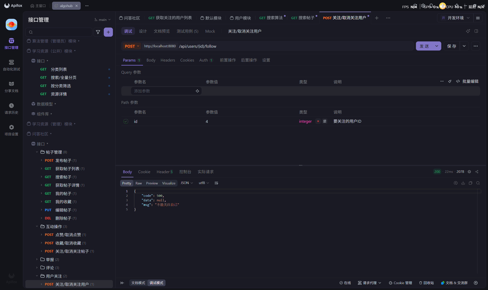 |
| 验证结论 | ✅ 已修复 |

---

### Bug-10：删除帖子/评论——非作者调用返回 success 但实际未删除

#### 10a. 非作者删除他人帖子

| 项目 | 内容 |
|---|---|
| 所属模块 | 问答社区 - 删除帖子 |
| 修复前 | 非作者 Token 删除他人帖子，返回 `code:200`，"删除成功"，但数据库未删除（见 [7.测试记录](./7.测试记录：问答社区-社区功能模块.md) TC-C44） |
| 修复后 | 同一请求，返回 `code:500`，"无权删除" |
| 修复后截图 | 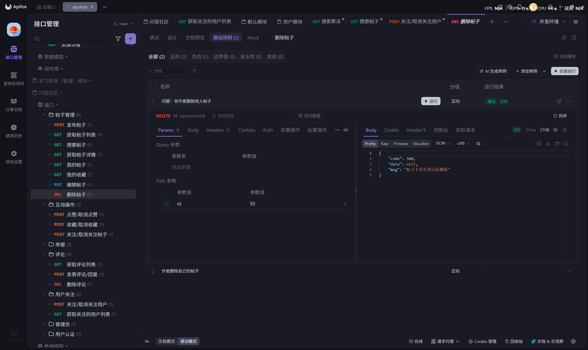 |
| 验证结论 | ✅ 已修复 |

#### 10b. 非作者删除他人评论

| 项目 | 内容 |
|---|---|
| 所属模块 | 问答社区 - 删除评论 |
| 修复前 | 非作者 Token 删除他人评论，返回 `code:200`，"删除成功"，但数据库未删除（见 [7.测试记录](./7.测试记录：问答社区-社区功能模块.md) TC-C42） |
| 修复后 | 同一请求，返回 `code:500`，"无权删除" |
| 修复后截图 | 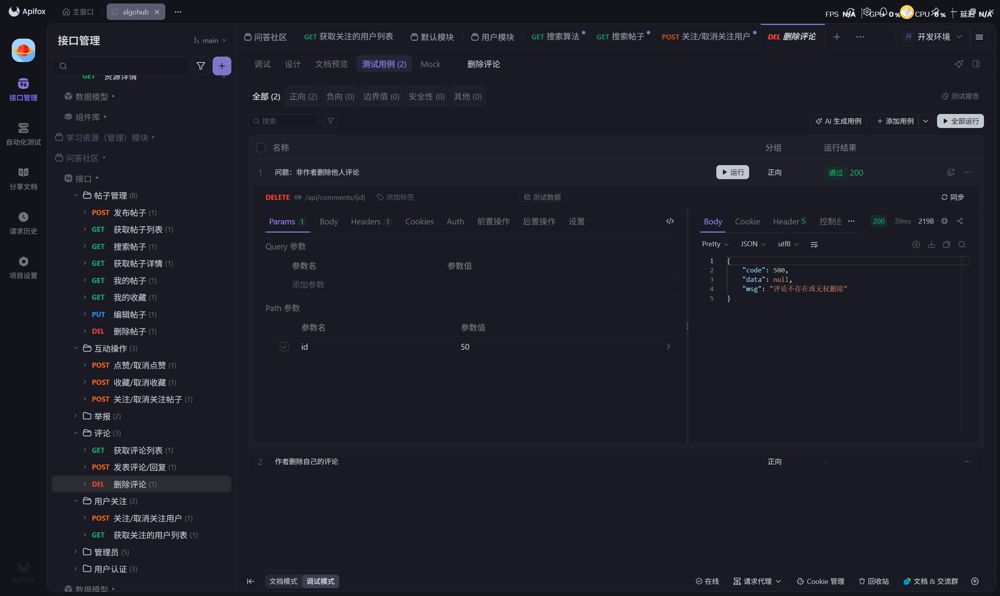 |
| 验证结论 | ✅ 已修复 |

---

## 二、优化项修复验证

### 优化-1：用户名禁止包含空格

| 项目 | 内容 |
|---|---|
| 所属模块 | 用户模块 - 注册 |
| 修复前 | 用户名包含中间空格可注册成功（见 [1.测试记录](./1.测试记录：用户体系-用户模块.md) TC-U04） |
| 修复后 | 用户名含空格，返回 `code:500`，拒绝注册 |
| 修复后截图 | 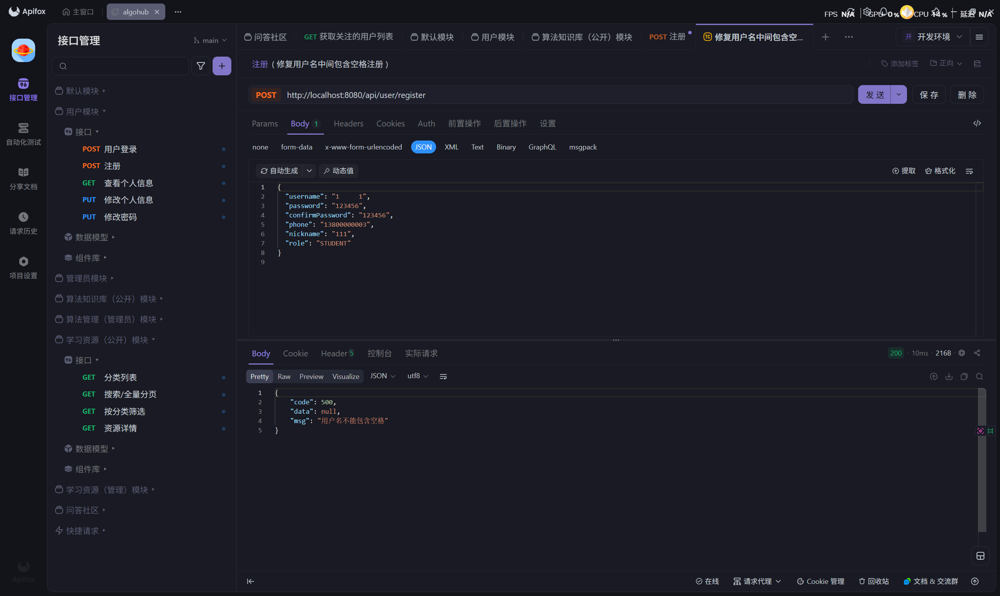 |
| 验证结论 | ✅ 已优化 |

---

### 优化-2：用户列表查询增加分页机制

| 项目 | 内容 |
|---|---|
| 所属模块 | 管理员模块 - 获取用户列表 |
| 修复前 | `listUsers` 直接 `findAll()` 返回全表数据，无分页（见 [2.测试记录](./2.测试记录：用户体系-管理员模块.md)） |
| 修复后 | 支持 `page`、`size` 参数，按页返回 |
| 修复后截图 | 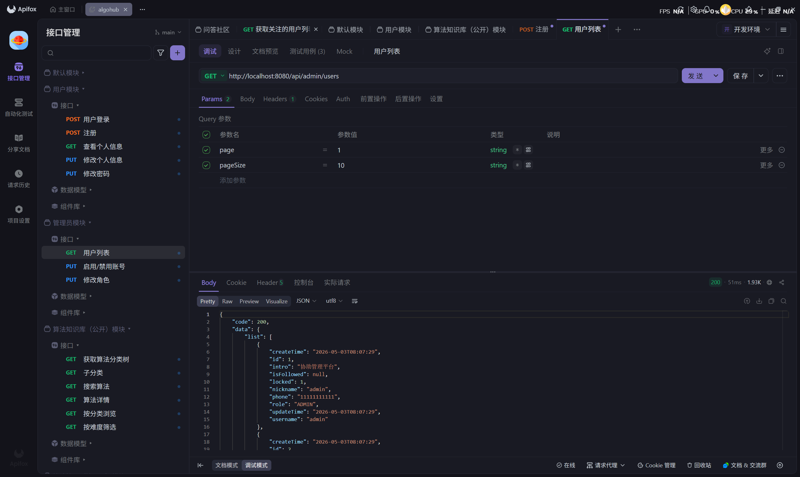 |
| 验证结论 | ✅ 已优化 |

---

### 优化-3：分页接口增加 pageSize 最大值限制

| 项目 | 内容 |
|---|---|
| 所属模块 | 算法知识库 - 分页接口 |
| 修复前 | pageSize 无上限，可传入超大数值导致性能问题 |
| 修复后 | pageSize 超过上限时自动截断或返回错误提示 |
| 修复后截图 | 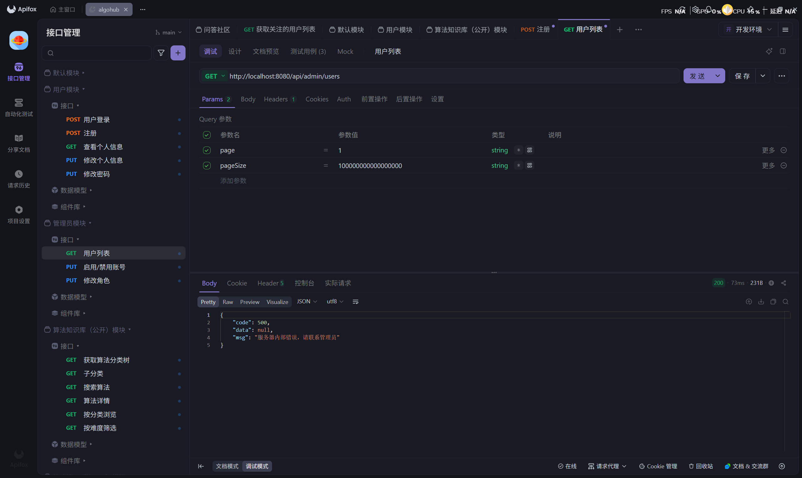 |
| 验证结论 | ✅ 已优化 |

---

### 优化-4：查询不存在分类返回友好提示

| 项目 | 内容 |
|---|---|
| 所属模块 | 算法知识库 - 按分类查询算法 |
| 修复前 | 传入不存在的分类 ID（99999），返回 `code:200` 空列表，无文字说明 |
| 修复后 | 传入不存在分类 ID，返回 `code:500`，"该分类不存在或已删除" |
| 修复后截图 |  |
| 验证结论 | ✅ 已优化 |

---

## 三、验证汇总

| 类别 | 总数 | 已验证通过 | 未通过 |
|---|---|---|---|
| 功能缺陷（Bug） | 10 | 10 | 0 |
| 优化项 | 4 | 4 | 0 |
| **合计** | **14** | **14** | **0** |

**结论：** 14 项缺陷及优化项全部修复并验证通过，系统功能正常。
