# 前端功能测试记录

**编写人：** 尹冰洁
**测试日期：** 2026-05-11
**测试环境：** Microsoft Edge 浏览器 + 本地前端开发服务器

---

## 测试清单

| 编号 | 模块 | 操作 | 预期结果 | 实际结果 | 截图 | 状态 |
|---|---|---|---|---|---|---|
| FT-01 | 注册 | 注册新账号 | 注册成功，自动跳转登录页 | 符合预期，注册成功并跳转登录页 | 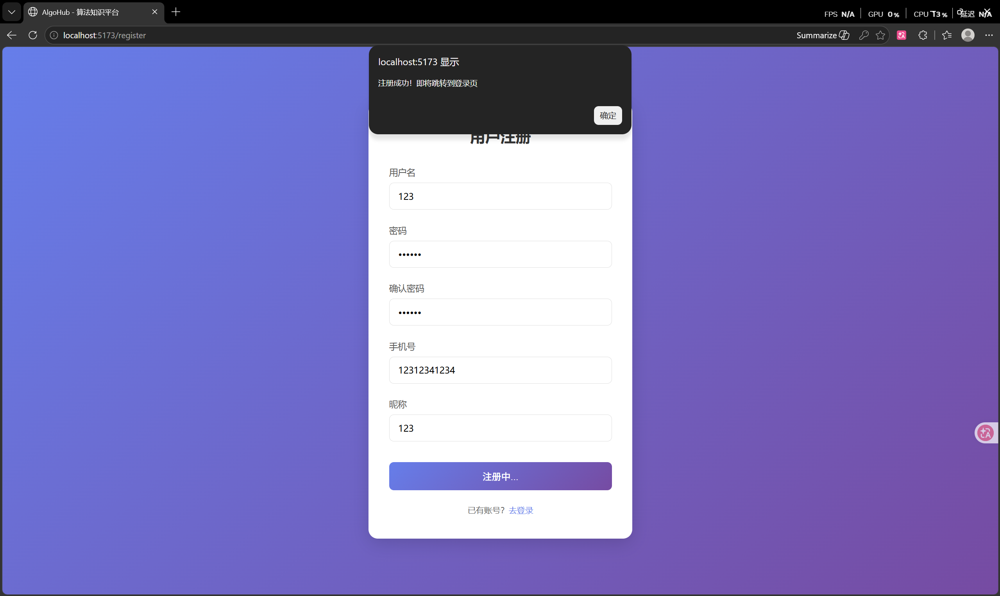 | ✅ 通过 |
| FT-02 | 登录 | 学生登录 | 登录成功，进入首页 | 符合预期，登录成功进入首页 | 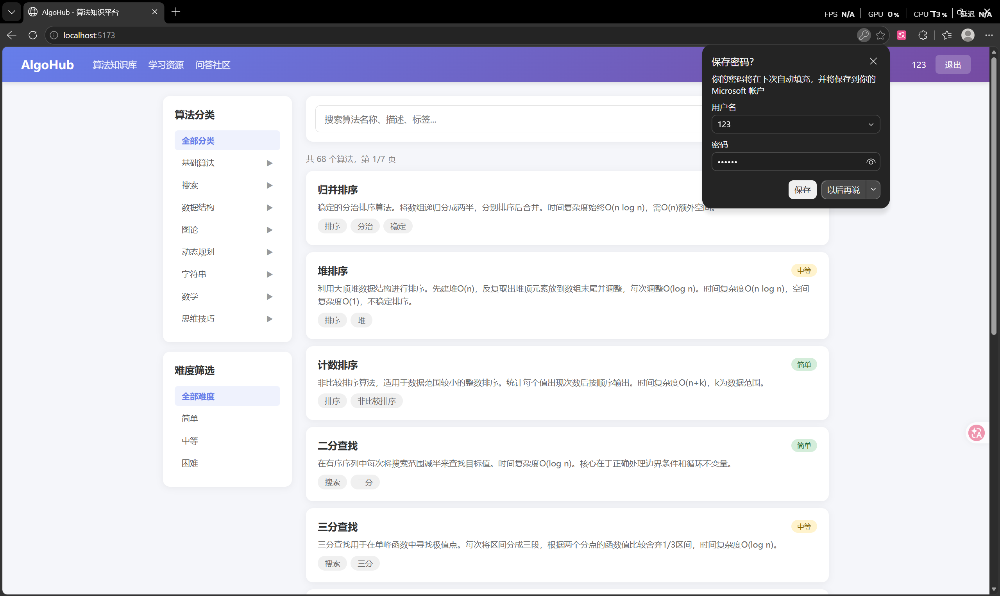 | ✅ 通过 |
| FT-03 | 登录 | 管理员登录 | 登录成功，进入首页，显示管理入口 | 符合预期，登录成功并显示管理入口 | 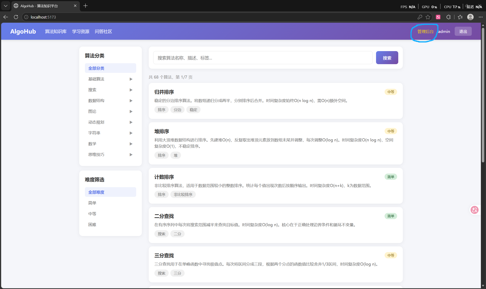 | ✅ 通过 |
| FT-04 | 个人中心 | 查看个人信息 + 修改昵称 | 信息展示正确，修改保存成功 | 符合预期，信息正确展示且修改保存成功 | 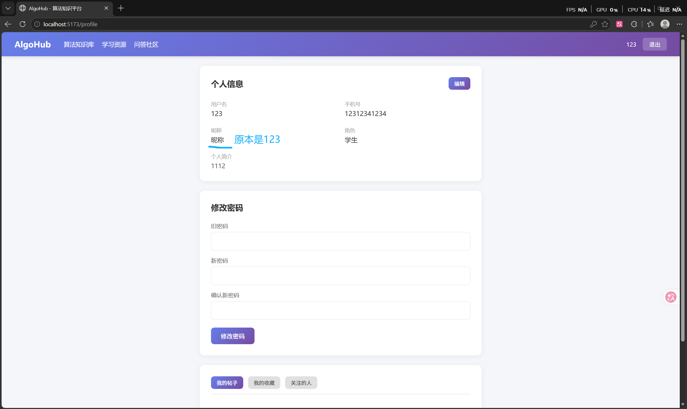 | ✅ 通过 |
| FT-05 | 个人中心 | 修改密码 | 输入新旧密码，修改成功 | 符合预期，密码修改成功 | 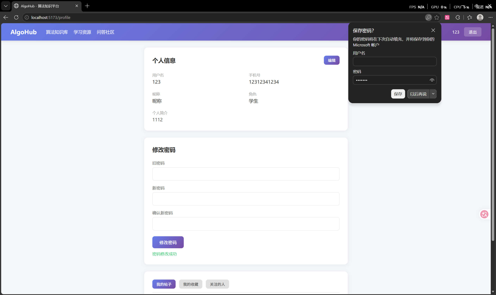 | ✅ 通过 |
| FT-06 | 算法浏览 | 浏览列表 + 搜索 + 点详情 | 列表正常展示，搜索有结果，详情页内容完整 | 符合预期，列表、搜索、详情均正常 | 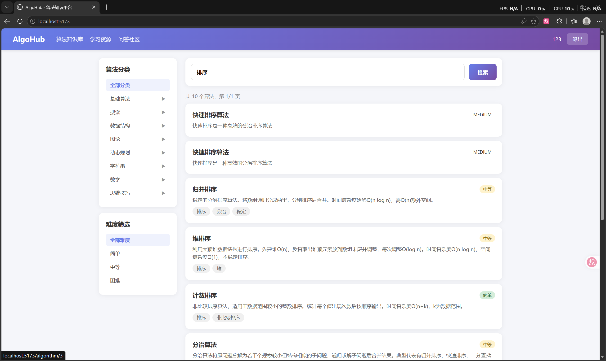 | ✅ 通过 |
| FT-07 | 资源浏览 | 浏览列表 + 搜索 + 按分类筛选 | 列表正常展示，分类筛选正确 | 符合预期，分类筛选正常 | 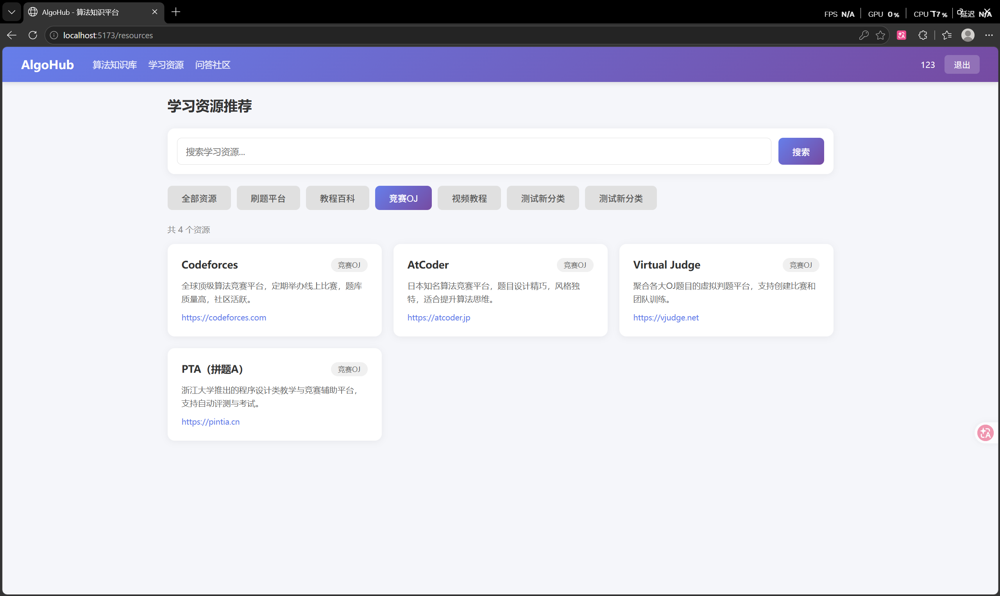 | ✅ 通过 |
| FT-08 | 社区 | 浏览帖子列表 | 列表正常 | 符合预期，列表正常展示 | 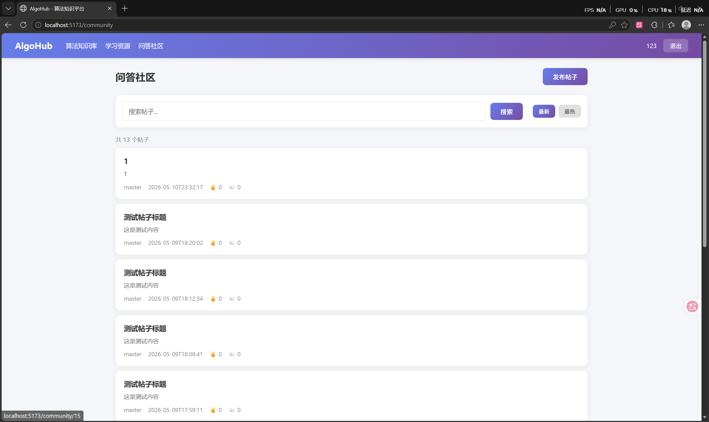 | ✅ 通过 |
| FT-09 | 社区 | 发布帖子 | 输入标题和内容，发布成功，列表可见 | 符合预期，发布成功且列表可见 | 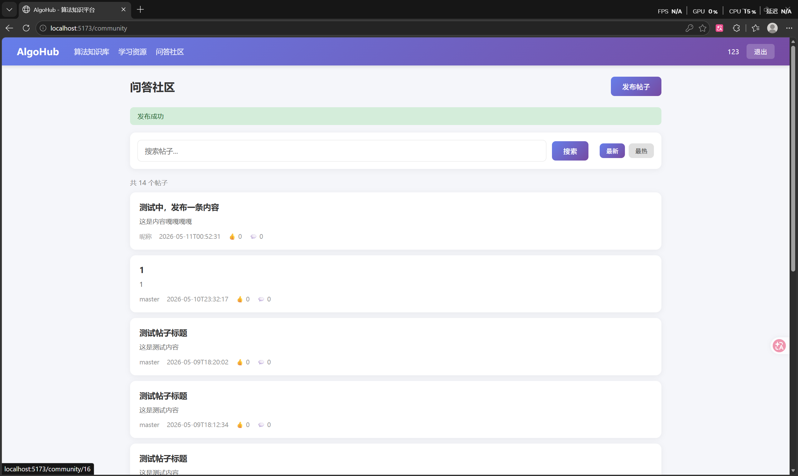 | ✅ 通过 |
| FT-10 | 社区 | 评论 + 点赞 + 收藏 | 评论发布成功，点赞/收藏状态切换正常 | 符合预期，评论、点赞、收藏均正常 | 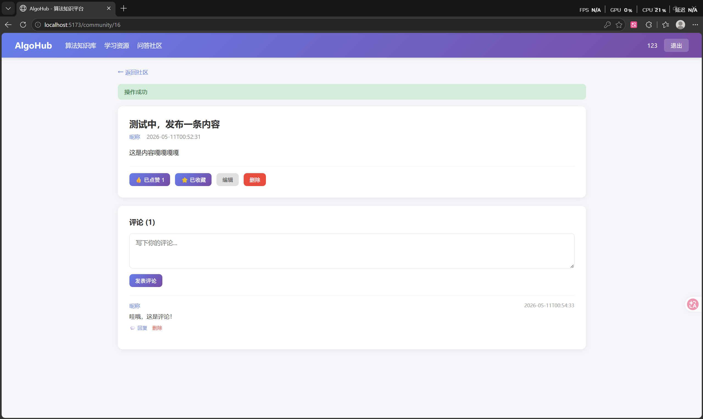 | ✅ 通过 |
| FT-11 | 管理员 | 用户管理列表 | 列表展示正常，分页可用 | 符合预期，列表及分页正常 | 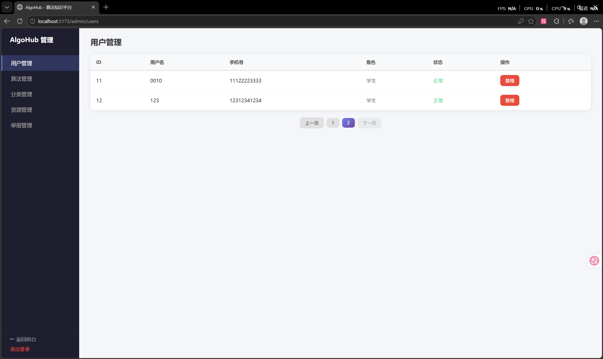 | ✅ 通过 |
| FT-12 | 管理员 | 禁用/启用 + 修改角色 | 操作生效，状态正确更新 | 符合预期，操作生效且状态正确更新 | 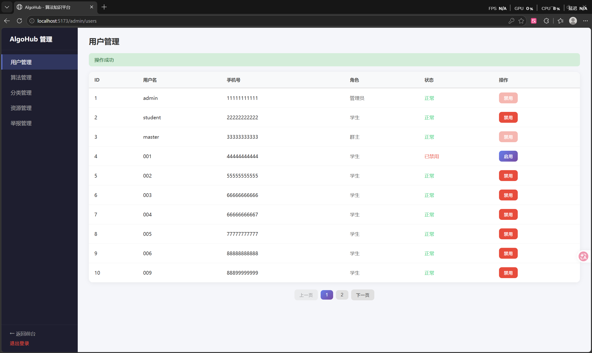 | ✅ 通过 |
| FT-13 | 管理员 | 举报管理 | 查看举报列表，处理/驳回操作正常 | 符合预期，处理与驳回操作正常 | 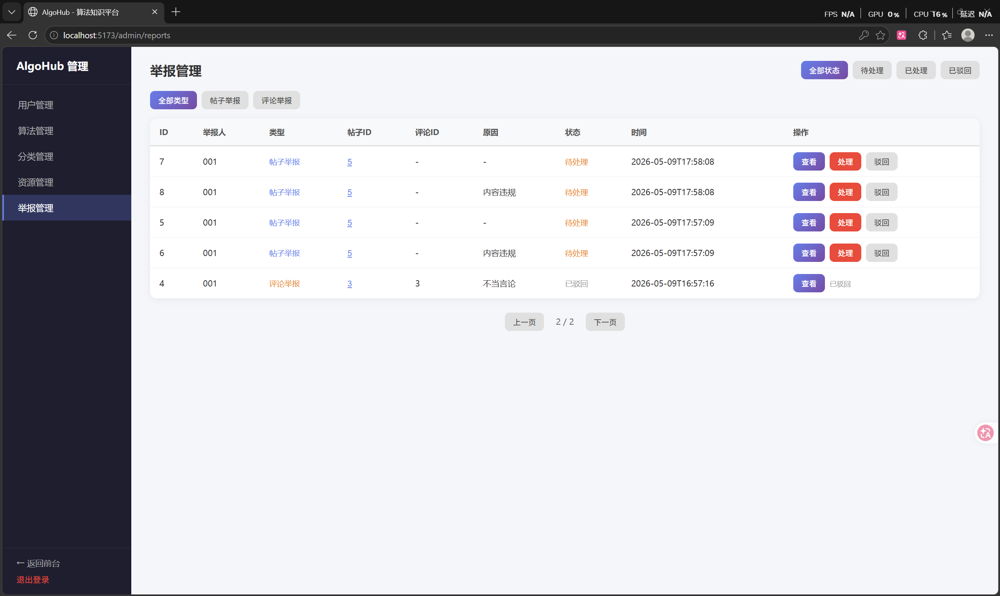 | ✅ 通过 |

---

## 汇总

| 总数 | 通过 | 未通过 |
|---|---|---|
| 13 | 13 | 0 |
